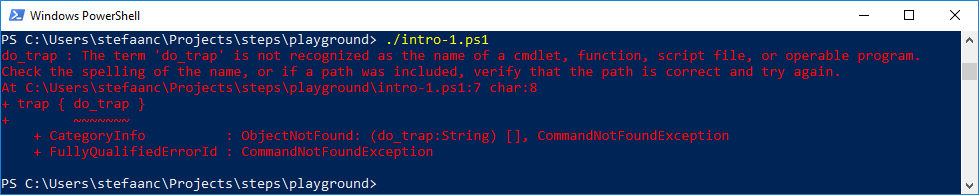
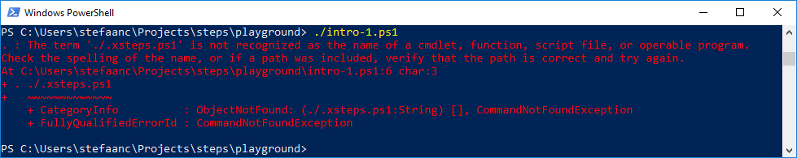
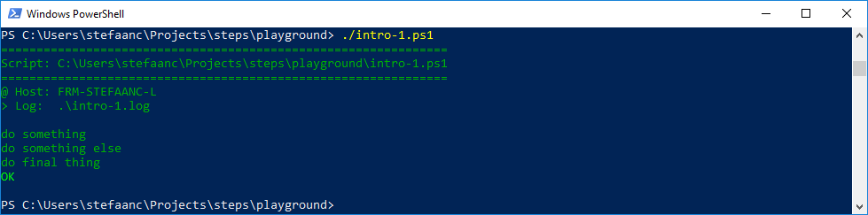
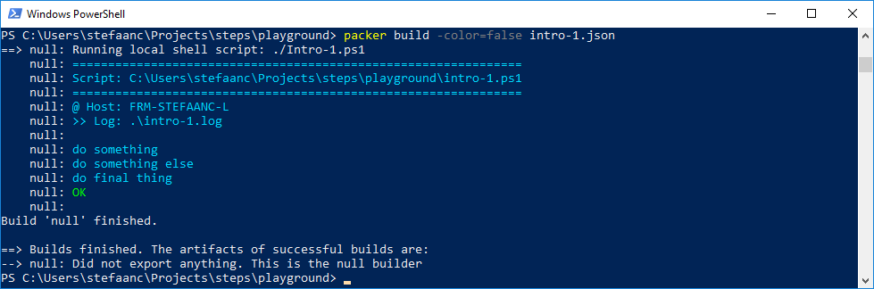

# STEPS

**a small library** 

- **to redirect the output of commands in your shell scripts to a log-file, while writing your own information to the terminal.**
- **to handle errors and exits in a concise and consistent manner**
- **with similar behaviour in different shells.**


<br/>

> Have you ever found your terminal "polluted" by all the stuff that is written by the commands in your scripts?
>
> - You can easily redirect the standard output to a log-file.
> - You can easily redirect the error output to a log-file.
>
>
> Have you ever redirected the standard output of your script to a log-file, but wanted a way to write some summary info to your terminal?  
> Have you ever redirected the error output of your script to a log-file, but still wanted to see an indication of these errors on your terminal?  
> Have you ever had trouble distinguishing between output from the main script and the output from a nested script?  
> Have you ever wished for code that handles output in different shells in a more similar way?
>
>- **STEPS will help you with this.**
>
>
> and...
> 
> Have you ever had trouble with errors in a script, causing trouble further down the line in the same or another script.
>
> - You can easily test the exit code of the last command and act on it (ps: `$LASTEXITCODE`, bash: `$?`)
> - You can easily test the execution status of the last command and act on it (ps: `$?`)
> - You can easily set a preferred error action to be taken (ps: `$ErrorActionPreference`)
> - You can also use more advanced exception techniques for errors (ps: `try`, `catch`, `finally`)
> - You can also use more advanced trapping techniques for errors (ps: `trap`, bash: `trap ERR`)
> - You can also use more advanced trapping techniques for exits (bash: `trap EXIT`)
>
>
> Have you ever found you program full of boiler-plate code to handle exit-codes, execution-statuses and exceptions?  
> Have you ever had trouble with your error-handling code when scripts are called by other scripts?  
> Have you ever found it difficult to implement and maintain consistent error behaviour and output for all these different techniques?  
> Are you sure you are exiting all your scripts with all the right exit conditions, everywhere in your code?  
> Have you ever wished for code that handles errors in different shells in a more similar way?
>
> - **STEPS will help you with this.**
>
>
> and finally...
> 
> Are you having trouble finding out about all these different techniques for different shells, trawling through 10s or perhaps even 100s of web-pages?  
> Have you given up <del>wasting</del> spending all this time finding and understanding all of these techniques that are often minimally documented?
>
> - **STEPS will help you with this.**
>
>

<br/>

> and a very last one...
>
> Are you curious about some of the solutions we learned to solve the above problems?  
> Do you want to learn how to do something similar yourself?
>
> - **STEPS will help you with this.**


<br/>

## Getting Started With STEPS In Powershell

Let's start with copying the STEPS library into our current directory.  You can find it on github in the STEPS project: `/scripts/.steps.ps1`

### A Basic Script

Write a basic powershell script that uses STEPS
```powershell {.line-numbers}
#
# Intro-1.ps1
#
$STEPS_LOG_FILE = ".\intro-1.log"

. .steps.ps1
trap { do_trap }

do_script

#
do_step "do something"

Write-Output "doing something"

#
do_step "do something else"

Write-Output "doing something else"

#
do_step "do final thing"

Write-Output "doing final thing"

#
do_exit 0
```

- `$STEPS_LOG_FILE` is setting the log-file STEPS will use
- `. .steps.ps1` dot-sources / includes / imports the STEPS library into our script
- `trap { do_trap }` sets up a mechanism to catch the errors thrown in our script or in the STEPS library
- `do_script` initializes the STEPS library and writes a script-header to both log-file and terminal
- `do_step` writes a step-header to both log-file and terminal
- `do_exit 0` writes a script-footer to both log-file and terminal
- all other output from the script is only sent to the log-file

  > :bulb:  
  > you can also use an environment `$env:STEPS_LOG_FILE` to set the log-file
  > or perhaps you prefer a parameter in your script `param( $STEPS_LOG_FILE = $env:STEPS_LOG_FILE )`

When running the script, our terminal will now look something like


And the log-file will look something like

```text

#
# ======================================================
# Script: C:\Users\stefaanc\steps\playground\intro-1.ps1
# ======================================================
#
# @ Host: FRM-STEFAANC-L
# > Log:  .\intro-1.log
#


#
# do something
#

doing something

#
# do something else
#

doing something else

#
# do final thing
#

doing final thing

# ==============================
```

#### Troubleshooting

When the script cannot dot-source the STEPS library or the script fails for some reason inside the library, you will typically get some error like



The issue is that the `do_trap` function has not yet been defined since the dot-sourcing failed.
To debug, comment out the `trap ( do_trap }` line in your script.  Be aware that the rest of your script will also run, so best to also put a `exit 1` line immediately after the `trap` line.  Re-running your script will now give more details about what is going wrong with the dot-sourcing.



### Other Features

For a more complete discussion, [click here](./docs/steps-in-powershell.md)

#### Generating an error


#### Catching exits


#### Providing more information


#### Nested Scripts


#### Changing Colors



#### ... and more

<br/>

## Calling A Script From Packer

> :warning:  
> The following assumes you have [packer](https://www.packer.io) installed on your machine.

Let's re-use our basic powershell script.
Since packer will be setting environment variables, we can drop the `$STEPS_LOG_FILE = ` line from the script.

```powershell {.line-numbers}
#
# Intro-1.ps1
#

. .steps.ps1
trap { do_trap }

#...
```

Now we create a packer JSON file with a provisioner of type `"shell-local"`

```javascript {.line-numbers}
{
    "builders": [
        {
            "type": "null",
            "communicator": "none"
        }
    ],    
    "provisioners": [
        {
            "type": "shell-local",
            "execute_command": ["PowerShell", "-NoProfile", "{{.Vars}}{{.Script}}; exit $LASTEXITCODE"],
            "env_var_format": "$env:%s=\"%s\"; ",
            "tempfile_extension": ".ps1",
            "environment_vars": [
                "STEPS_LOG_FILE=./intro-1.log",
                "STEPS_LOG_APPEND=false"
            ],
            "scripts": [
                "./Intro-1.ps1"
            ]
        }
    ]
}
```
- Remark that we added `"exit $LASTEXITCODE"` to the `"execute_command"` property of the provioner.  This is propagate to the exitcode from our script to packer.  If that is not done, packer will always report an `Erroneous exit code 1` when things go wrong, instead of the real exitcode.

When running packer, our terminal will now look something like



- To run packer, we added the option `-color=false` so packer coloring doesn't interfere with STEPS coloring.  You can also do this using an environment variable for packer `$env:PACKER_NO_COLOR = "true"`

Or when we generate an error


> :bulb:  
> We can also do this for packer post-processors

<br>

## Learnings and Techniques

- TBD

<br>

## For Further Investigation

- reset exit-code and/or errors-array at start of a script (with an option?)
- add a script/function trace to error output (with an option?)
- using aliases `exit` and `echo` for `do_exit` and `do_echo` (is this possible?)
- research and cover other ways of running a command (f.i. powershell Invoke methods)
- in powershell: add an option to leave script with exception instead of exitcode?
- in powershell: correct the error-records for `do_exit` and `do_catch_exit` (is this possible?)
- use PSScriptAnalyser
- automated testing (or automation assisted testing)
