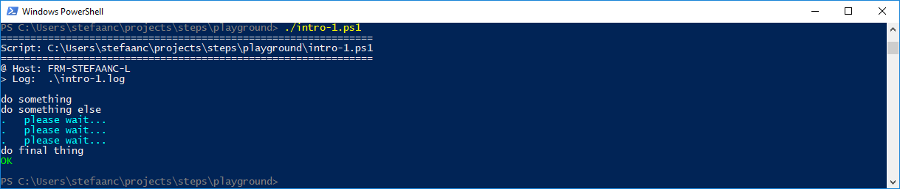

# STEPS

**a small library** 

- **to redirect the output of commands in your shell scripts to a log-file, while writing your own information to the terminal.**
- **to handle errors and exits in a concise and consistent manner**
- **with similar behaviour in different shells.**

 

> Have you ever found your terminal "polluted" by all the stuff that is written by the commands in your scripts?
>
> - You can easily redirect the standard output to a log-file.
> - You can easily redirect the error output to a log-file.
>
>
> Have you ever redirected the standard output of your script to a log-file, but wanted a way to write some summary info to your terminal?  
> Have you ever redirected the error output of your script to a log-file, but still wanted to see an indication of these errors on your terminal?  
> Have you ever had trouble distinguishing between output from the main script and the output from a nested script?  
> Have you ever wished for code that handles output in different shells in a more similar way?
>
>- **STEPS will help you with this.**
>
>
> and...
> 
> Have you ever had trouble with errors in a script, causing trouble further down the line in the same or another script.
>
> - You can easily test the exit code of the last command and act on it (ps: `$LASTEXITCODE`, bash: `$?`)
> - You can easily test the execution status of the last command and act on it (ps: `$?`)
> - You can easily set a preferred error action to be taken (ps: `$ErrorActionPreference`)
> - You can also use more advanced exception techniques for errors (ps: `try`, `catch`, `finally`)
> - You can also use more advanced trapping techniques for errors (ps: `trap`, bash: `trap ERR`)
> - You can also use more advanced trapping techniques for exits (bash: `trap EXIT`)
>
>
> Have you ever found you program full of boiler-plate code to handle exit-codes, execution-statuses and exceptions?  
> Have you ever had trouble with your error-handling code when scripts are called by other scripts?  
> Have you ever found it difficult to implement and maintain consistent error behaviour and output for all these different techniques?  
> Are you sure you are exiting all your scripts with all the right exit conditions, everywhere in your code?  
> Have you ever wished for code that handles errors in different shells in a more similar way?
>
> - **STEPS will help you with this.**
>
>
> and finally...
> 
> Are you having trouble finding out about all these different techniques for different shells, trawling through 10s or perhaps even 100s of web-pages?  
> Have you given up <del>wasting</del> spending all this time finding and understanding all of these techniques that are often minimally documented?
>
> - **STEPS will help you with this.**
>
>

 

> and a very last one...
>
> Are you curious about some of the solutions we found to solve the above problems?  
> Do you want to learn how to do something similar yourself?
>
> - **STEPS will help you with this.**

 

## Getting Started With STEPS In Powershell

Copy the STEPS library into your scripts directory.  You can find it on github in the STEPS project: `/scripts/.steps.ps1`

### The Basics

#### [A successful script](./docs/powershell/a-successful-script.md)

#### [Generating an error](./docs/powershell/generating-an-error.md)

#### [Catching exits](./docs/powershell/catching-exits.md)

#### [Providing more information](./docs/powershell/providing-more-information.md)

#### [Nesting scripts](./docs/powershell/nesting-scripts.md)

### Advanced Topics

[**Scripts with parameters**](./docs/powershell/scripts-with-parameters.md)  
[**Native commands that write status-info to stderr**](./docs/powershell/native-commands-that-write-status-info-to-stderr.md)  
**TBD** [**Native commands that use exitcode for status-info**]()  
[**Appending to a log-file**](./docs/powershell/appending-to-a-log-file.md)  
[**Changing colors**](./docs/powershell/changing-colors.md)

### Troubleshooting

When the script cannot dot-source the STEPS library or the script fails for some reason inside the library, you will typically get some error like

The issue is that the `do_trap` function has not yet been defined since the dot-sourcing failed.
To debug, comment out the `trap ( do_trap }` line in your script.  Be aware that the rest of your script will also run, so best to also put a `exit 1` line immediately after the `trap` line.  Re-running your script will now give more details about what is going wrong with the dot-sourcing.

 

## Calling A Script From Packer

#### [Calling a powershell script from packer](./docs/powershell/calling-a-script-from-packer.md)

 

## Learnings and Techniques

### Powershell

- **TBD**

 

## For Further Investigation

- reset errors-array at start of a script (with an option?)
- add a script/function trace to error output (with an option?)
- using aliases `exit` and `echo` for `do_exit` and `do_echo` (is this possible?)
- in powershell: research and cover other ways of running a command (f.i. powershell Invoke methods)
- in powershell: add an option to leave script with exception instead of exitcode?
- in powershell: correct the error-records for `do_exit` and `do_catch_exit` (is this possible?)
- in powershell: research difference between white and red `$Error` output (see [**Native commands that write status-info to stderr**](./docs/powershell/native-commands-that-write-status-info-to-stderr.md))
- in powershell: recover the output from native commands, written to `stderr` and stored in `$Error`, and write it to Success stream (see [**Native commands that write status-info to stderr**](./docs/powershell/native-commands-that-write-status-info-to-stderr.md)).
- use PSScriptAnalyser
- automated testing (or automation assisted testing)
