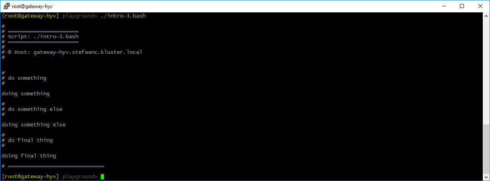

## A Successful Script

Write a basic bash script that uses STEPS

```shell
#
# intro-3.bash
#

. ./.steps.bash

do_script

#
do_step "do something"

echo "doing something"

#
do_step "do something else"

echo "doing something else"

#
do_step "do final thing"

echo "doing final thing"

#
do_exit 0
```

- `. ./.steps.bash` dot-sources / includes / imports the STEPS library into our script
- `do_script` initializes the STEPS library and writes a script-header
- `do_step` writes a step-header
- `do_exit 0` writes a script-footer

When running the script, our terminal will now look something like


