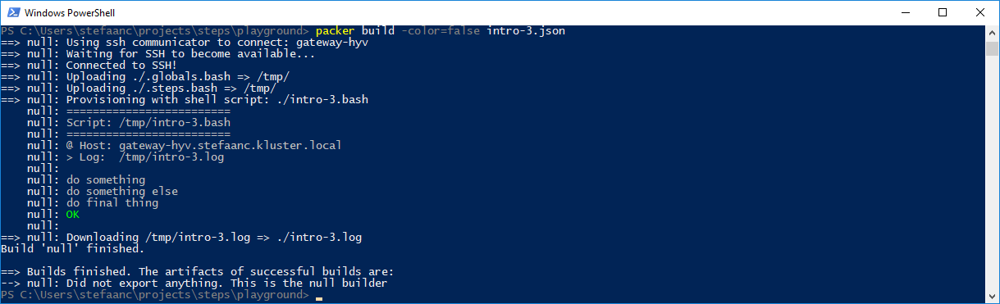

## Calling A Script From Packer

> :warning:  
> The following assumes you have [packer](https://www.packer.io) installed on your machine.

Let's re-use our basic bash script.
Since packer will be setting environment variables, we can drop the `STEPS_LOG_FILE=...` line from the script.

```shell
#
# intro-3.bash
#
                                 # <<<<<<<<<<<<<<<<<<<<<<<<<<<<<<<<<<<<<<<<<<<<<

. "$( dirname ${BASH_SOURCE[0]} )/.steps.bash"

do_script

#
do_step "do something"

echo "doing something"

#
do_step "do something else"

echo "doing something else"

#
do_step "do final thing"

echo "doing final thing"

#
do_exit 0
```

Now we create a packer JSON file with a provisioner of type `"shell"`

```javascript
{
    "builders": [
        {
            "type": "null",
            "ssh_host": "gateway-hyv",
            "ssh_username": "root",
            "ssh_password": "*** root-password ***"
        }
    ],
    "provisioners": [
        {
            "type": "file",
            "source": "./.globals.bash",
            "destination": "/tmp/"
        },
        {
            "type": "file",
            "source": "./.steps.bash",
            "destination": "/tmp/"
        },
        {
            "type": "shell",
            "environment_vars": [
                "STEPS_LOG_FILE=/tmp/intro-3.log",
                "STEPS_LOG_APPEND=false"
            ],
            "remote_file": "intro-3.bash",
            "scripts": [
                "./intro-3.bash"
            ]
        },
        {
            "type": "file",
            "source": "/tmp/intro-3.log",
            "destination": "./intro-3.log",
            "direction": "download"
        }
    ]
}
```
- Remark that you will need to use the correct root-password.

When running packer, our terminal will now look something like



- To run packer, we added the option `-color=false` so packer coloring doesn't interfere with STEPS coloring.  You can also do this using an environment variable for packer `$env:PACKER_NO_COLOR = "true"`

Or when we generate an error


> :bulb:  
> We can also do this for packer post-processors
