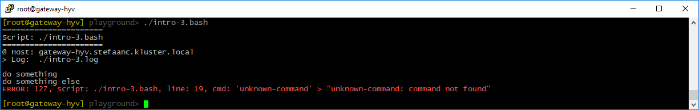

## Catching Errors

Let's modify the basic script to generate an error

```shell
#
# intro-3.bash
#

STEPS_LOG_FILE="./intro-3.log"

. ./.steps.bash

do_script

#
do_step "do something"

echo "doing something"

#
do_step "do something else"

unknown-command   # <<<<<<<<<<<<<<<<<<<<<<<<<<<<<<<<<<<<<<<<<<<<<<<<<<<<<<<<<<<<

#
do_step "do final thing"

echo "doing final thing"

#
do_exit 0
```

- `unknown-command` generates an error

When running the script, our terminal will now look something like



And the log-file will look something like

```text

#
# ======================
# Script: ./intro-3.bash
# ======================
#
# @ Host: gateway-hyv.stefaanc.kluster.local
# > Log:  ./intro-3.log
#


#
# do something
#

doing something

#
# do something else
#

./intro-3.bash: line 19: unknown-command: command not found

#
# ERROR: 127, script: ./intro-3.bash, line: 19, cmd: 'unknown-command' > "unknown-command: command not found"
#

```
