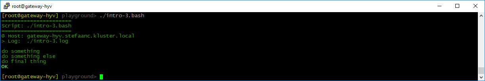
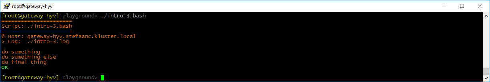
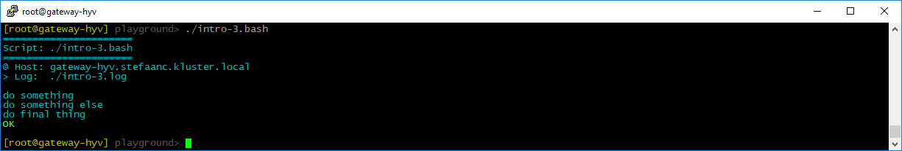
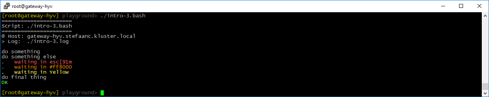
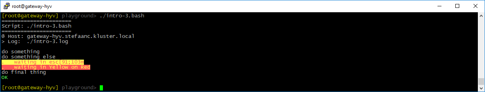

## Changing Colors

### Changing The Default Colors

You can change the colors using a variable in the script or environment.

```shell
#
# intro-3.bash
#

STEPS_LOG_FILE="./intro-3.log"

STEPS_COLORS="\e[38;2;56;144;0m,\e[96m,\e[92m,\e[93m,\e[91m"   # <<<<<<<<<<<<<<<
#             normal           ,bright,green ,yellow,red       # <<<<<<<<<<<<<<<

. ./.steps.bash

do_script

#
do_step "do something"

echo "doing something"

#
do_step "do something else"

echo "doing something else"

#
do_step "do final thing"

echo "doing final thing"

#
do_exit 0
```

- `STEPS_COLORS="\e[...` defines the "normal", "bright", "green", "yellow", "red" color-codes in a comma separated list without spaces.  In the example, we changed the "normal" color from the default code for bash (`\e[37m`) to the RGB code `\e[38;2;56;144;0m`.

  > :bulb:  
  > For a good overview of the ANSI/VT100 color-codes, [you can look here](https://misc.flogisoft.com/bash/tip_colors_and_formatting) and on [wikipedia](https://en.wikipedia.org/wiki/ANSI_escape_code)

When running the script, our terminal will now look something like



You can also use RGB colors using hex codes in the format `#rrggbb` - make sure you use lower-case letters for the hex numbers.

```shell
STEPS_COLORS="#cb6416,\e[96m,\e[92m,\e[93m,\e[91m"   # <<<<<<<<<<<<<<<<<<<<<<<<<
#             normal ,bright,green ,yellow,red       # <<<<<<<<<<<<<<<<<<<<<<<<<
```

This gives



Finally, you can also use the PowerShell pallete color names `Black`, `DarkBlue`, `DarkGreen`, `DarkCyan`, `DarkRed`, `DarkMagenta`, `DarkYellow`, `Gray`, `DarkGray`, `Blue`, `Green`, `Cyan`, `Red`, `Magenta`, `Yellow` or `White`.

```shell
$STEPS_COLORS = "DarkCyan,\e[96m,\e[92m,\e[93m,\e[91m"   # <<<<<<<<<<<<<<<<<<<<<
#                normal  ,bright,green ,yellow,red       # <<<<<<<<<<<<<<<<<<<<<
```

This gives




<br/>

### Changing The Color Of `do_echo`

Using options for `do_echo` you can change the foreground- and background-colors of the information written to the console.

For the foreground color, you can use all three color-formats in the option `--color`: VT100 escape codes, RGB hex codes, or PowerShell palette color names.

```shell
#
# intro-3.bash
#

STEPS_LOG_FILE="./intro-3.log"

. ./.steps.bash

do_script

#
do_step "do something"

echo "doing something"

#
do_step "do something else"

do_echo --color "\e[91m" "waiting in esc[91m"    # <<<<<<<<<<<<<<<<<<<<<<<<<<<<<
do_echo --color "#ff8000" "waiting in #ff8000"   # <<<<<<<<<<<<<<<<<<<<<<<<<<<<<
do_echo --color Yellow "waiting in Yellow"       # <<<<<<<<<<<<<<<<<<<<<<<<<<<<<

#
do_step "do final thing"

echo "doing final thing"

#
do_exit 0
```



For the background color, you can either use a VT100 escape code with foreground and background colors in the option `--color`, or you can use PowerShell palette color names in the option `--foregroundcolor` and `--backgroundcolor`

```shell
#
# intro-3.bash
#

STEPS_LOG_FILE="./intro-3.log"

. ./.steps.bash

do_script

#
do_step "do something"

echo "doing something"

#
do_step "do something else"

do_echo --color "\e[91;103m" "waiting in esc[91;103m"                               # <<<<<<<<<<
do_echo --foregroundcolor Yellow --backgroundcolor Red "waiting in Yellow on Red"   # <<<<<<<<<<

#
do_step "do final thing"

echo "doing final thing"

#
do_exit 0
```


