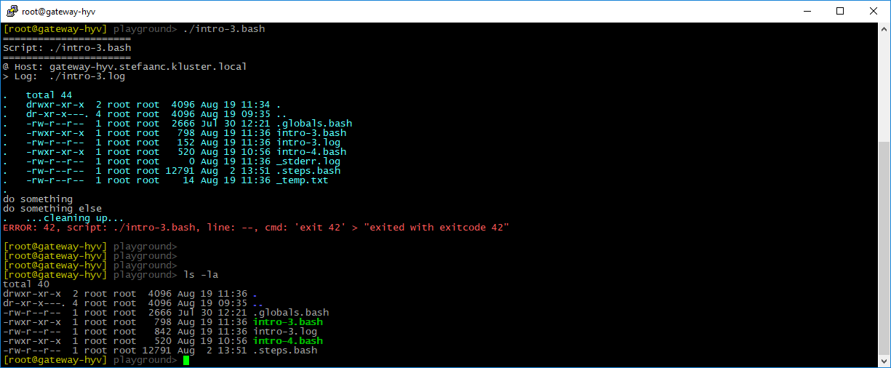

## Cleaning Up

Sometimes it is necessary to clean-up things after running a script - for instance removing temp-files.  When you unexpectedly encounter a problem and need to exit this script, you need special measures for this to happen.

Using `do_cleanup`, you can define a command that is executed whenever you exit your script - when it completes successfully or when it fails.

```shell
#
# intro-3.bash
#

STEPS_LOG_FILE="./intro-3.log"

. ./.steps.bash

do_script

echo "my temp stuff" > ./_temp.txt                          # <<<<<<<<<<<<<<<<<<
do_cleanup "do_echo '...cleaning up...'; rm -f _temp.txt"   # <<<<<<<<<<<<<<<<<<

ls -la | do_echo                                            # <<<<<<<<<<<<<<<<<<
do_echo " "                                                 # <<<<<<<<<<<<<<<<<<

#
do_step "do something"

echo "doing something"

#
do_step "do something else"

if [ "true" ] ; then   # <<<<<<<<<<<<<<<<<<<<<<<<<<<<<<<<<<<<<<<<<<<<<<<<<<<<<<<
    exit 42            # <<<<<<<<<<<<<<<<<<<<<<<<<<<<<<<<<<<<<<<<<<<<<<<<<<<<<<<
fi                     # <<<<<<<<<<<<<<<<<<<<<<<<<<<<<<<<<<<<<<<<<<<<<<<<<<<<<<<

#
do_step "do final thing"

echo "doing final thing"

#
do_exit 0
```



- remark the `_stderr.log`-file is a file used by STEPS to capture error-output, and it is automatically removed when leaving STEPS.
- remark the `_temp.txt`-file in the file-list written by the script.
- remark this file is not there anymore in the output after the script completes.
