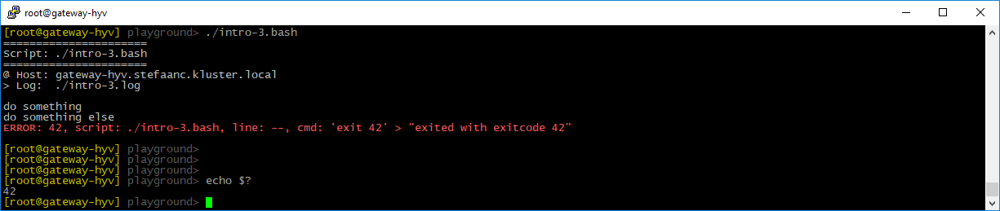
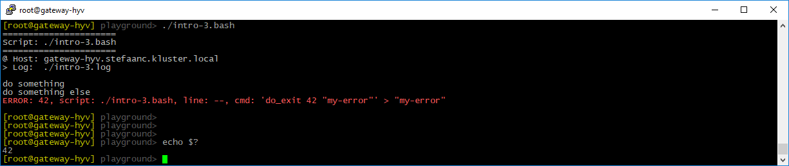

## Exiting

When something is going wrong we typically want to exit our script.  For instance, we test a condition and exit when the condition is met.

```shell
#
# intro-3.bash
#

STEPS_LOG_FILE="./intro-3.log"

. ./.steps.bash

do_script

#
do_step "do something"

echo "doing something"

#
do_step "do something else"

if [ "true" ] ; then   # <<<<<<<<<<<<<<<<<<<<<<<<<<<<<<<<<<<<<<<<<<<<<<<<<<<<<<<
    exit 42            # <<<<<<<<<<<<<<<<<<<<<<<<<<<<<<<<<<<<<<<<<<<<<<<<<<<<<<<
fi                     # <<<<<<<<<<<<<<<<<<<<<<<<<<<<<<<<<<<<<<<<<<<<<<<<<<<<<<<

#
do_step "do final thing"

echo "doing final thing"

#
do_exit 0
```



- remark that `$?` returns `42`.

To improve on this we can add an optional error-message using `do_exit`

```shell
if [ "true" ] ; then        # <<<<<<<<<<<<<<<<<<<<<<<<<<<<<<<<<<<<<<<<<<<<<<<<<<
    do_exit 42 "my-error"   # <<<<<<<<<<<<<<<<<<<<<<<<<<<<<<<<<<<<<<<<<<<<<<<<<<
fi                          # <<<<<<<<<<<<<<<<<<<<<<<<<<<<<<<<<<<<<<<<<<<<<<<<<<
```


