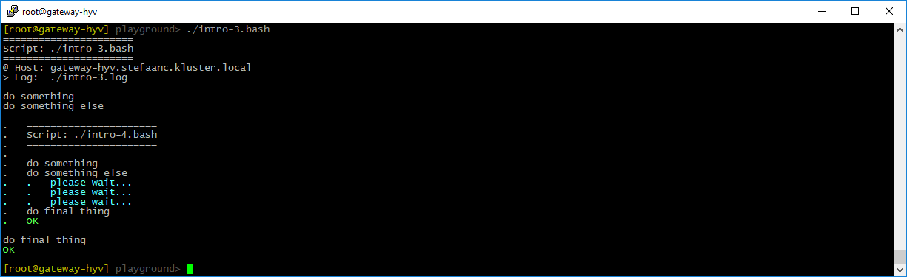

## Nesting Scripts

To illustrate nested scripts, create two scripts "intro-3.bash" and "intro-4.bash".  Modify the basic script "intro-3.bash" to make a call to "intro-4.bash".  Modify the basic script "intro-4.bash" to provide more information to the terminal, and drop the `$STEPS_LOG_FILE` setting.

```shell
#
# intro-3.bash
#

STEPS_LOG_FILE="./intro-3.log"

. ./.steps.bash

do_script

#
do_step "do something"

echo "doing something"

#
do_step "do something else"

call ./intro-4.bash   # <<<<<<<<<<<<<<<<<<<<<<<<<<<<<<<<<<<<<<<<<<<<<<<<<<<<<<<<

#
do_step "do final thing"

echo "doing final thing"

#
do_exit 0
```

```shell
#
# intro-4.bash
#
                               # <<<<<<<<<<<<<<<<<<<<<<<<<<<<<<<<<<<<<<<<<<<<<<<

. ./.steps.bash

do_script

#
do_step "do something"

echo "doing something"

#
do_step "do something else"

for i in `seq 1 3`; do         # <<<<<<<<<<<<<<<<<<<<<<<<<<<<<<<<<<<<<<<<<<<<<<<
    do_echo "please wait..."   # <<<<<<<<<<<<<<<<<<<<<<<<<<<<<<<<<<<<<<<<<<<<<<<
    sleep 1                    # <<<<<<<<<<<<<<<<<<<<<<<<<<<<<<<<<<<<<<<<<<<<<<<
done                           # <<<<<<<<<<<<<<<<<<<<<<<<<<<<<<<<<<<<<<<<<<<<<<<

#
do_step "do final thing"

echo "doing final thing"

#
do_exit 0
```

- `call ./intro-4.bash` in the first script, calls the second script.  Remark that the `call`-function is required if we want to see the proper indentation on our terminal.  This function is defined in the GLOBALS library and is loaded by STEPS.
- `$STEPS_LOG_FILE` is dropped from the second script, so we get all output in a single log-file.

When running the script, our terminal will now look something like



And the log-file will look something like

```text

#
# ======================
# Script: ./intro-3.bash
# ======================
#
# @ Host: gateway-hyv.stefaanc.kluster.local
# > Log:  ./intro-3.log
#


#
# do something
#

doing something

#
# do something else
#


#
# ======================
# Script: ./intro-4.bash
# ======================
#


#
# do something
#

doing something

#
# do something else
#

# please wait...
# please wait...
# please wait...

#
# do final thing
#

doing final thing

# ==============================


#
# do final thing
#

doing final thing

# ==============================
```
