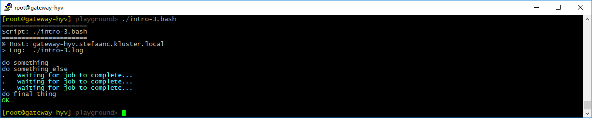
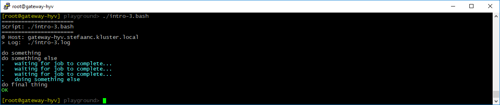
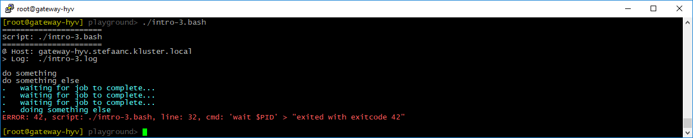

## Providing Information During Long-Running Native Commands

When using a native command that is taking a long time to complete, you may want to provide some kind of info.

### Providing Information

Lets write a script to run our long-running native command in the background, while providing some information as long as it is running.

```shell
#
# intro-3.bash
#

STEPS_LOG_FILE="./intro-3.log"

. ./.steps.bash

do_script

#
do_step "do something"

echo "doing something"

#
do_step "do something else"

sleep 15 &                                     # <<<<<<<<<<<<<<<<<<<<<<<<<<<<<<<
PID=$!                                         # <<<<<<<<<<<<<<<<<<<<<<<<<<<<<<<

while [[ -d /proc/$PID ]] ; do                 # <<<<<<<<<<<<<<<<<<<<<<<<<<<<<<<
    do_echo "waiting for job to complete..."   # <<<<<<<<<<<<<<<<<<<<<<<<<<<<<<<
    sleep 5                                    # <<<<<<<<<<<<<<<<<<<<<<<<<<<<<<<
done                                           # <<<<<<<<<<<<<<<<<<<<<<<<<<<<<<<

#
do_step "do final thing"

echo "doing final thing"

#
do_exit 0
```

- the first set of commands starts the background job with our long-running native command - simulated by `sleep`.
- the second set of commands provides some information to the user, as long as the background job is running.




<br/>


### Capturing Output

If our native command provides output, we may want to show it on the terminal.

```shell
#
# intro-3.bash
#

STEPS_LOG_FILE="./intro-3.log"

. ./.steps.bash

do_script

#
do_step "do something"

echo "doing something"

#
do_step "do something else"

{                                              # <<<<<<<<<<<<<<<<<<<<<<<<<<<<<<<
    sleep 5                                    # <<<<<<<<<<<<<<<<<<<<<<<<<<<<<<<
    echo "doing something else"                # <<<<<<<<<<<<<<<<<<<<<<<<<<<<<<<
    sleep 10                                   # <<<<<<<<<<<<<<<<<<<<<<<<<<<<<<<
} | do_echo &                                  # <<<<<<<<<<<<<<<<<<<<<<<<<<<<<<<
PID=$!                                         # <<<<<<<<<<<<<<<<<<<<<<<<<<<<<<<

while [[ -d /proc/$PID ]] ; do                 # <<<<<<<<<<<<<<<<<<<<<<<<<<<<<<<
    do_echo "waiting for job to complete..."   # <<<<<<<<<<<<<<<<<<<<<<<<<<<<<<<
    sleep 5                                    # <<<<<<<<<<<<<<<<<<<<<<<<<<<<<<<
done                                           # <<<<<<<<<<<<<<<<<<<<<<<<<<<<<<<

#
do_step "do final thing"

echo "doing final thing"

#
do_exit 0
```

- we added a line to our background job, writing something to output using `echo`, and piping it to `do_echo`.



```text

#
# ======================
# Script: ./intro-3.bash
# ======================
#
# @ Host: gateway-hyv.stefaanc.kluster.local
# > Log:  ./intro-3.log
#


#
# do something
#

doing something

#
# do something else
#

# waiting for job to complete...
# waiting for job to complete...
# waiting for job to complete...
# doing something else

#
# do final thing
#

doing final thing

# ==============================
```


<br/>

### Catching The Exit-code

When our native command fails, we want to catch the exit-code

```shell
#
# intro-3.bash
#

STEPS_LOG_FILE="./intro-3.log"

. ./.steps.bash

do_script

#
do_step "do something"

echo "doing something"

#
do_step "do something else"

{                                              # <<<<<<<<<<<<<<<<<<<<<<<<<<<<<<<
    sleep 5                                    # <<<<<<<<<<<<<<<<<<<<<<<<<<<<<<<
    echo "doing something else"                # <<<<<<<<<<<<<<<<<<<<<<<<<<<<<<<
    sleep 10                                   # <<<<<<<<<<<<<<<<<<<<<<<<<<<<<<<
    exit 42                                    # <<<<<<<<<<<<<<<<<<<<<<<<<<<<<<<
} | do_echo &                                  # <<<<<<<<<<<<<<<<<<<<<<<<<<<<<<<
PID=$!                                         # <<<<<<<<<<<<<<<<<<<<<<<<<<<<<<<

while [[ -d /proc/$PID ]] ; do                 # <<<<<<<<<<<<<<<<<<<<<<<<<<<<<<<
    do_echo "waiting for job to complete..."   # <<<<<<<<<<<<<<<<<<<<<<<<<<<<<<<
    sleep 5                                    # <<<<<<<<<<<<<<<<<<<<<<<<<<<<<<<
done                                           # <<<<<<<<<<<<<<<<<<<<<<<<<<<<<<<

wait $PID                                      # <<<<<<<<<<<<<<<<<<<<<<<<<<<<<<<

#
do_step "do final thing"

echo "doing final thing"

#
do_exit 0
```

- we added a failing line of code to our background job.
- the line `wait $PID` catches the exit-code and traps an error when not `0`.


