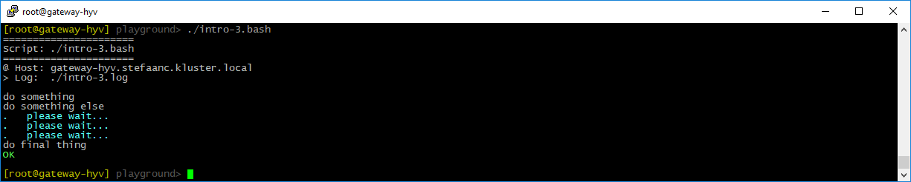
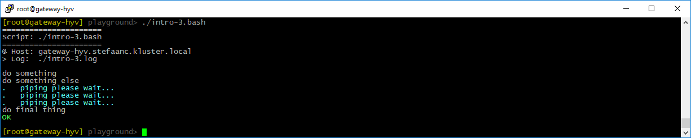
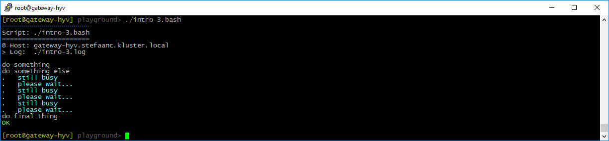

## Providing More Information

Let's modify the basic script to provide more information to the terminal.

```shell
#
# intro-3.bash
#

STEPS_LOG_FILE="./intro-3.log"

. ./.steps.bash

do_script

#
do_step "do something"

echo "doing something"

#
do_step "do something else"

for i in `seq 1 3`; do         # <<<<<<<<<<<<<<<<<<<<<<<<<<<<<<<<<<<<<<<<<<<<<<<
    do_echo "please wait..."   # <<<<<<<<<<<<<<<<<<<<<<<<<<<<<<<<<<<<<<<<<<<<<<<
    sleep 1                    # <<<<<<<<<<<<<<<<<<<<<<<<<<<<<<<<<<<<<<<<<<<<<<<
done                           # <<<<<<<<<<<<<<<<<<<<<<<<<<<<<<<<<<<<<<<<<<<<<<<

#
do_step "do final thing"

echo "doing final thing"

#
do_exit 0
```

- `do_echo "please wait..."` writes some extra information to the terminal

When running the script, our terminal will now look something like



And the log-file will look something like

```text

#
# ======================
# Script: ./intro-3.bash
# ======================
#
# @ Host: gateway-hyv.stefaanc.kluster.local
# > Log:  ./intro-3.log
#


#
# do something
#

doing something

#
# do something else
#

# please wait...
# please wait...
# please wait...

#
# do final thing
#

doing final thing

# ==============================
```

<br/>

You can also pipe to `do_echo`

```shell
#
# intro-3.bash
#

STEPS_LOG_FILE="./intro-3.log"

. ./.steps.bash

do_script

#
do_step "do something"

echo "doing something"

#
do_step "do something else"

for i in `seq 1 3`; do
    echo "piping please wait..." | do_echo   # <<<<<<<<<<<<<<<<<<<<<<<<<<<<<<<<<
    sleep 1
done

#
do_step "do final thing"

echo "doing final thing"

#
do_exit 0
```



<br/>

`do_echo` also supports multi-line strings (don't copy the `# <<<<<<...` comments in your script)

```shell
#
# intro-3.bash
#

STEPS_LOG_FILE="./intro-3.log"

. ./.steps.bash

do_script

#
do_step "do something"

echo "doing something"

#
do_step "do something else"

for i in `seq 1 3`; do
    do_echo <<EOF   # <<<<<<<<<<<<<<<<<<<<<<<<<<<<<<<<<<<<<<<<<<<<<<<<<<<<<<<<<<
still busy          # <<<<<<<<<<<<<<<<<<<<<<<<<<<<<<<<<<<<<<<<<<<<<<<<<<<<<<<<<<
please wait...      # <<<<<<<<<<<<<<<<<<<<<<<<<<<<<<<<<<<<<<<<<<<<<<<<<<<<<<<<<<
EOF                 # <<<<<<<<<<<<<<<<<<<<<<<<<<<<<<<<<<<<<<<<<<<<<<<<<<<<<<<<<<
    sleep 1
done

#
do_step "do final thing"

echo "doing final thing"

#
do_exit 0
```


