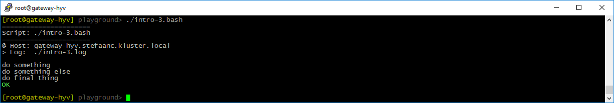

## Summarizing To Terminal And Logging To File

Let's define a log-file in our basic script

```shell
#
# intro-3.bash
#

STEPS_LOG_FILE="./intro-3.log"   # <<<<<<<<<<<<<<<<<<<<<<<<<<<<<<<<<<<<<<<<<<<<<

. ./.steps.bash

do_script

#
do_step "do something"

echo "doing something"

#
do_step "do something else"

echo "doing something else"

#
do_step "do final thing"

echo "doing final thing"

#
do_exit 0
```

- `$STEPS_LOG_FILE` is the log-file STEPS will use
- The output from `do_script`, `do_step` and `do_exit` will now be sent to both the terminal and the log-file, while all other output will be sent to the log-file only.

When running the script, our terminal will now look something like



And the log-file will look something like

```text

#
# ======================
# Script: ./intro-3.bash
# ======================
#
# @ Host: gateway-hyv.stefaanc.kluster.local
# > Log:  ./intro-3.log
#


#
# do something
#

doing something

#
# do something else
#

doing something else

#
# do final thing
#

doing final thing

# ==============================
```
