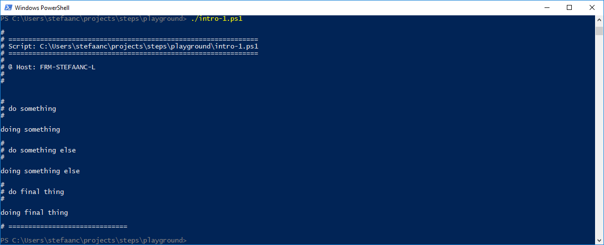

## A Successful Script

Write a basic powershell script that uses STEPS

```powershell
#
# Intro-1.ps1
#

. ./.steps.ps1
trap { do_trap }

do_script

#
do_step "do something"

Write-Output "doing something"

#
do_step "do something else"

Write-Output "doing something else"

#
do_step "do final thing"

Write-Output "doing final thing"

#
do_exit 0
```

- `. ./.steps.ps1` dot-sources / includes / imports the STEPS library into our script
- `trap { do_trap }` sets up a mechanism to catch the errors thrown in our script or in the STEPS library
- `do_script` initializes the STEPS library and writes a script-header
- `do_step` writes a step-header
- `do_exit 0` writes a script-footer

When running the script, our terminal will now look something like


