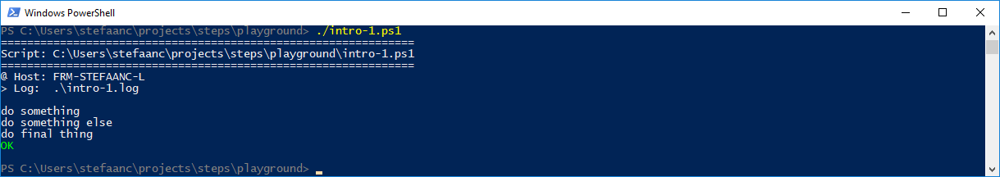

## A Successful Script

Write a basic powershell script that uses STEPS

```powershell
#
# Intro-1.ps1
#
$STEPS_LOG_FILE = ".\intro-1.log"

. ./.steps.ps1
trap { do_trap }

do_script

#
do_step "do something"

Write-Output "doing something"

#
do_step "do something else"

Write-Output "doing something else"

#
do_step "do final thing"

Write-Output "doing final thing"

#
do_exit 0
```

- `$STEPS_LOG_FILE` is setting the log-file STEPS will use
- `. ./.steps.ps1` dot-sources / includes / imports the STEPS library into our script
- `trap { do_trap }` sets up a mechanism to catch the errors thrown in our script or in the STEPS library
- `do_script` initializes the STEPS library and writes a script-header to both log-file and terminal
- `do_step` writes a step-header to both log-file and terminal
- `do_exit 0` writes a script-footer to both log-file and terminal
- all other output from the script is only sent to the log-file

  > :bulb:  
  > you can also use an environment `$env:STEPS_LOG_FILE` to set the log-file
  > or perhaps you prefer a parameter in your script `param( $STEPS_LOG_FILE = $env:STEPS_LOG_FILE )`

When running the script, our terminal will now look something like



And the log-file will look something like

```text

#
# ======================================================
# Script: C:\Users\stefaanc\steps\playground\intro-1.ps1
# ======================================================
#
# @ Host: FRM-STEFAANC-L
# > Log:  .\intro-1.log
#


#
# do something
#

doing something

#
# do something else
#

doing something else

#
# do final thing
#

doing final thing

# ==============================
```
