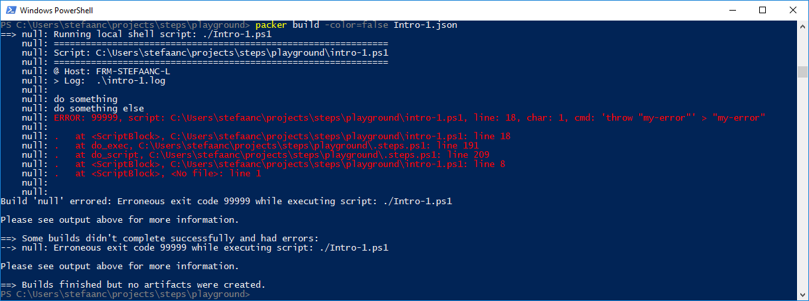

## Calling A Script From Packer

> :warning:  
> The following assumes you have [packer](https://www.packer.io) installed on your machine.

Let's re-use our basic powershell script.
Since packer will be setting environment variables, we can drop the `$STEPS_LOG_FILE = ` line from the script.

```powershell
#
# Intro-1.ps1
#
                                 # <<<<<<<<<<<<<<<<<<<<<<<<<<<<<<<<<<<<<<<<<<<<<

. ./.steps.ps1
trap { do_trap }

do_script

#
do_step "do something"

Write-Output "doing something"

#
do_step "do something else"

Write-Output "doing something else"

#
do_step "do final thing"

Write-Output "doing final thing"

#
do_exit 0
```

Now we create a packer JSON file with a provisioner of type `"shell-local"`

```javascript
{
    "builders": [
        {
            "type": "null",
            "communicator": "none"
        }
    ],    
    "provisioners": [
        {
            "type": "shell-local",
            "execute_command": ["PowerShell", "-NoProfile", "{{.Vars}}{{.Script}}; exit $LASTEXITCODE"],
            "env_var_format": "$env:%s=\"%s\"; ",
            "tempfile_extension": ".ps1",
            "environment_vars": [
                "STEPS_LOG_FILE=./intro-1.log",
                "STEPS_LOG_APPEND=false"
            ],
            "scripts": [
                "./Intro-1.ps1"
            ]
        }
    ]
}
```
- Remark that we added `"exit $LASTEXITCODE"` to the `"execute_command"` property of the provioner.  This is to propagate the exitcode from our script to packer.  If that is not done, packer will always report an `Erroneous exit code 1` when things go wrong, instead of the real exitcode.

When running packer, our terminal will now look something like


- To run packer, we added the option `-color=false` so packer coloring doesn't interfere with STEPS coloring.  You can also do this using an environment variable for packer `$env:PACKER_NO_COLOR = "true"`

Or when we generate an error




> :bulb:  
> We can also do this for packer post-processors
