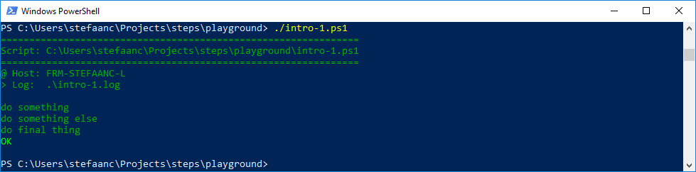

## Changing Colors

You can change the colors using another variable in the script or environment.

```powershell
#
# Intro-1.ps1
#
$STEPS_LOG_FILE = ".\intro-1.log"

$e = [char]27                                               # <<<<<<<<<<<<<<<<<<
$STEPS_COLORS = "$e[38;5;34m,$e[92m,$e[93m,$e[91m,$e[0m"    # <<<<<<<<<<<<<<<<<<
#                normal     ,green ,yellow,red   ,reset     # <<<<<<<<<<<<<<<<<<

. ./.steps.ps1
trap { do_trap }

do_script

#
do_step "do something"

Write-Output "doing something"

#
do_step "do something else"

Write-Output "doing something else"

#
do_step "do final thing"

Write-Output "doing final thing"

#
do_exit 0
```

- `$e = [char]27` gives us the ASCII code 27 for "escape".
- `$STEPS_COLORS = "$e[...` defines the "normal", "green", "yellow", "red" and "reset" color-codes in a comma separated list without spaces.  In the example, we changed the "normal" color from the default code for powershell (`$e[38;5;45m`) to the code `$e[38;5;34m`.

  > :bulb:  
  > For a good overview of the ANSI/VT100 color-codes, [click here](https://misc.flogisoft.com/bash/tip_colors_and_formatting)

When running the script, our terminal will now look something like


