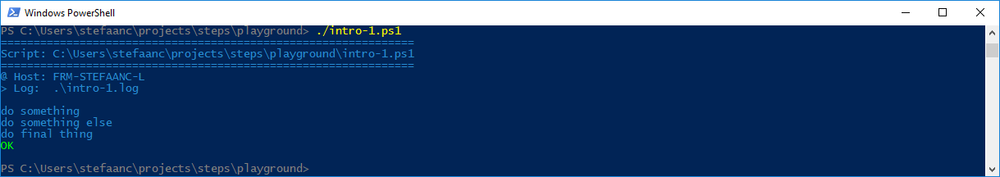
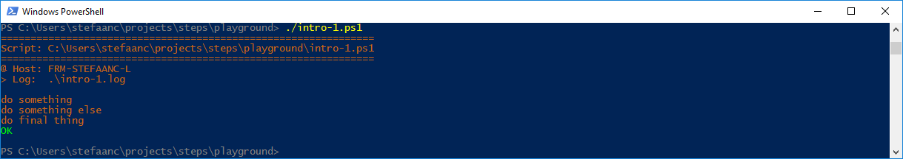
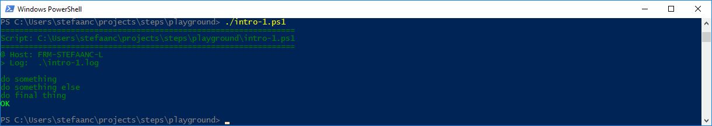

## Changing Colors

### Changing The Default Colors

You can change the colors using a variable in the script or environment.

```powershell
#
# Intro-1.ps1
#

$STEPS_LOG_FILE = ".\intro-1.log"

$e = [char]27                                                        # <<<<<<<<<<<<<<<<<<
$STEPS_COLORS = "$e[38;2;38;139;210m,$e[96m,$e[92m,$e[93m,$e[91m"    # <<<<<<<<<<<<<<<<<<
#                normal             ,bright,green ,yellow,red        # <<<<<<<<<<<<<<<<<<

. ./.steps.ps1
trap { do_trap }

do_script

#
do_step "do something"

Write-Output "doing something"

#
do_step "do something else"

Write-Output "doing something else"

#
do_step "do final thing"

Write-Output "doing final thing"

#
do_exit 0
```

- `$e = [char]27` gives us the ASCII code 27 for "escape".
- `$STEPS_COLORS = "$e[...` defines the "normal", "bright", "green", "yellow", "red" color-codes in a comma separated list without spaces.  In the example, we changed the "normal" color from the default code for powershell (`$e[33m`) to the RGB code `$e[38;2;38;139;210m`.

  > :bulb:  
  > For a good overview of the ANSI/VT100 color-codes, [click here](https://misc.flogisoft.com/bash/tip_colors_and_formatting), and on [wikipedia](https://en.wikipedia.org/wiki/ANSI_escape_code)

When running the script, our terminal will now look something like



You can also use RGB colors using hex codes in the format `#RRGGBB` - make sure you use lower-case letters for the hex numbers.

```powershell
$e = [char]27                                            # <<<<<<<<<<<<<<<<<<
$STEPS_COLORS = "#cb6416,$e[96m,$e[92m,$e[93m,$e[91m"    # <<<<<<<<<<<<<<<<<<
#                normal ,bright,green ,yellow,red        # <<<<<<<<<<<<<<<<<<
```

This gives



Finally, you can also use the PowerShell pallete colors `Black`, `DarkBlue`, `DarkGreen`, `DarkCyan`, `DarkRed`, `DarkMagenta`, `DarkYellow`, `Gray`, `DarkGray`, `Blue`, `Green`, `Cyan`, `Red`, `Magenta`, `Yellow` or `White`.

> :warning:  
> Legacy PowerShell consoles use `DarkMagenta` and `DarkYellow` as background and foreground colors.

> :bulb:  
> You can redefine the console colors for PowerShell as explained in the [PSCONSOLE repository](https://github.com/stefaanc/psconsole#the-colors-of-the-console)


```powershell
$e = [char]27                                              # <<<<<<<<<<<<<<<<<<
$STEPS_COLORS = "DarkGreen,$e[96m,$e[92m,$e[93m,$e[91m"    # <<<<<<<<<<<<<<<<<<
#                normal   ,bright,green ,yellow,red        # <<<<<<<<<<<<<<<<<<
```

This gives


