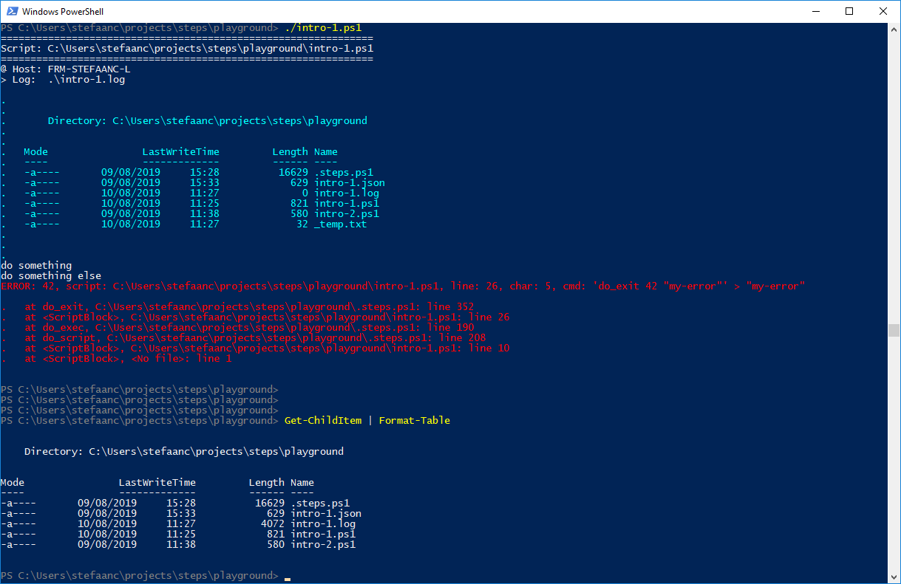

## Cleaning Up

Sometimes it is necessary to clean-up things after running a script - for instance removing temp-files.  When you unexpectedly encounter a problem and need to exit this script, you need special measures for this to happen.

Using `do_cleanup`, you can define a command that is executed whenever you exit your script - when it completes successfully or when it fails.

```powershell
#
# Intro-1.ps1
#

$STEPS_LOG_FILE = ".\intro-1.log"

. ./.steps.ps1
trap { do_trap }

do_script

Write-Output "my temp stuff" | Out-File ./_temp.txt   # <<<<<<<<<<<<<<<<<<<<<<<<<<<<<<
do_cleanup "do_echo '...cleaning up...'; Remove-Item -Force _temp.txt"   # <<<<<<<<<<<

Get-ChildItem | Format-Table | Out-String | do_echo   # <<<<<<<<<<<<<<<<<<<<<<<<<<<<<<

#
do_step "do something"

Write-Output "doing something"

#
do_step "do something else"

if ( $true ) {                                        # <<<<<<<<<<<<<<<<<<<<<<<<<<<<<<
    do_exit 42 "my-error"                             # <<<<<<<<<<<<<<<<<<<<<<<<<<<<<<
}                                                     # <<<<<<<<<<<<<<<<<<<<<<<<<<<<<<

#
do_step "do final thing"

Write-Output "doing final thing"

#
do_exit 0
```



- remark the `_temp.txt`-file in the file-list written by the script.
- remark this file is not there anymore in the output after the script completes.

> :warning:  
> STEPS is initialized by the `do_script` command, **not** when sourcing `.steps.ps1`.  Never use `do_cleanup` (or any other STEPS command) before the `do_script` command.
