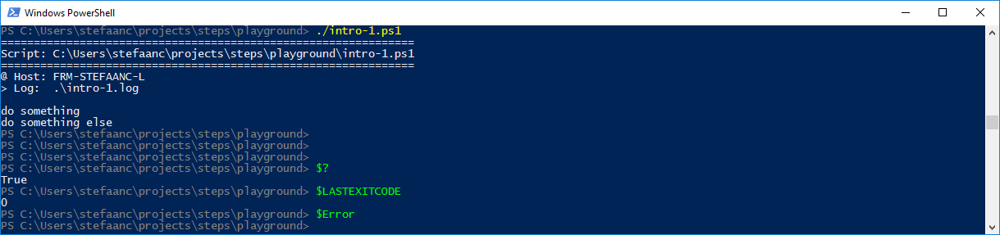
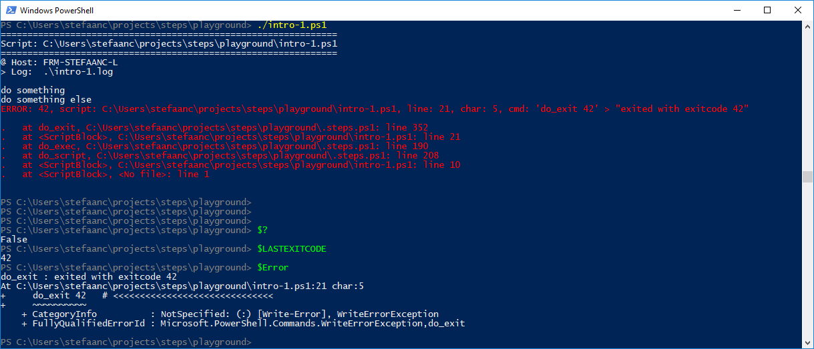
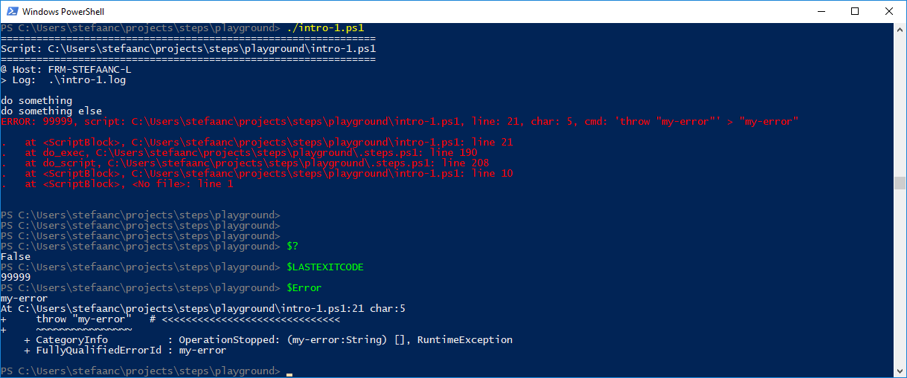
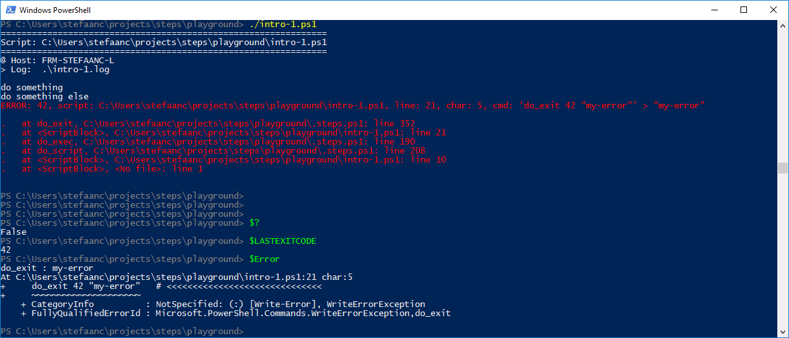

## Exiting

When something is going wrong we typically want to exit our script.  For instance, we test a condition and exit when the condition is met.

```powershell
#
# Intro-1.ps1
#

$STEPS_LOG_FILE = ".\intro-1.log"

. ./.steps.ps1
trap { do_trap }

do_script

#
do_step "do something"

Write-Output "doing something"

#
do_step "do something else"

if ( $true ) {   # <<<<<<<<<<<<<<<<<<<<<<<<<<<<<<
    exit 42      # <<<<<<<<<<<<<<<<<<<<<<<<<<<<<<
}                # <<<<<<<<<<<<<<<<<<<<<<<<<<<<<<

#
do_step "do final thing"

Write-Output "doing final thing"

#
do_exit 0
```



- remark that the script stops abruptly, there is no `OK` or `Error`-line.  This is because STEPS cannot catch an exit, it can only catch errors.
- remark that `$?` returns `True` and `$LASTEXITCODE` returns `0`.  Because STEPS cannot catch the exit, it exits with an 0 exitcode.

To solve this, we can use `do_exit`

```powershell
if ( $true ) {   # <<<<<<<<<<<<<<<<<<<<<<<<<<<<<<
    do_exit 42   # <<<<<<<<<<<<<<<<<<<<<<<<<<<<<<
}                # <<<<<<<<<<<<<<<<<<<<<<<<<<<<<<
```



- remark we now get the corect `$?` and `$LASTEXITCODE`.
- remark that we get a general `"exited with exitcode 42"` error-message.

To set a  proper error-message, we can instead `throw` an error

```powershell
if ( $true ) {         # <<<<<<<<<<<<<<<<<<<<<<<<<<<<<<
    throw "my-error"   # <<<<<<<<<<<<<<<<<<<<<<<<<<<<<<
}                      # <<<<<<<<<<<<<<<<<<<<<<<<<<<<<<
```



- remark that `$LASTEXITCODE` returns a general `99999`.  There is no way to `throw` with a specific exit code.

To improve on this we can use an optional error-message for `do_exit`

```powershell
if ( $true ) {              # <<<<<<<<<<<<<<<<<<<<<<<<<<<<<<
    do_exit 42 "my-error"   # <<<<<<<<<<<<<<<<<<<<<<<<<<<<<<
}                           # <<<<<<<<<<<<<<<<<<<<<<<<<<<<<<
```



- remark we now have an exit-code, an error and error-message.

> :bulb:  
> - Never use `exit`.  
> - Use `throw` in try-catch statements.  
> - Use `do_exit` when exiting a script.
