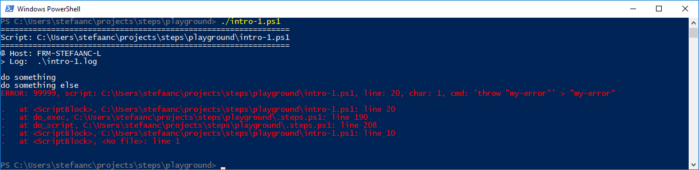

## Generating An Error

Let's modify the basic script to throw an error

```powershell
#
# Intro-1.ps1
#
$STEPS_LOG_FILE = ".\intro-1.log"

. ./.steps.ps1
trap { do_trap }

do_script

#
do_step "do something"

Write-Output "doing something"

#
do_step "do something else"

throw "my-error"                 # <<<<<<<<<<<<<<<<<<<<<<<<<<<<<<<<<<<<<<<<<<<<<

#
do_step "do final thing"

Write-Output "doing final thing"

#
do_exit 0
```

- `throw "my-error"` throws a terminating error

  > :bulb:  
  > STEPS is setting `$ErrorActionPreference = 'Stop'` to catch non-terminating errors from for instance `Write-Error "my-error"`.  If you prefer, you can reset this after you dot-sourced the library, to some other value like `'Continue'` or `'SilentlyContinue'`.
  > Also, most powershell methods allow you to override this for a single command using an option, for instance `-ErrorAction 'Ignore'`

When running the script, our terminal will now look something like



And the log-file will look something like

```text

#
# ======================================================
# Script: C:\Users\stefaanc\steps\playground\intro-1.ps1
# ======================================================
#
# @ Host: FRM-STEFAANC-L
# > Log:  .\intro-1.log
#


#
# do something
#

doing something

#
# do something else
#


#
# ERROR: 99999, line: 19, char: 1, cmd: 'throw "my-error"' > "my-error"
#

my-error
At C:\Users\stefaanc\steps\playground\intro-1.ps1:19 char:1
+ throw "my-error"
+ ~~~~~~~~~~~~~~~~
    + CategoryInfo          : OperationStopped: (my-error:String) [], RuntimeException
    + FullyQualifiedErrorId : my-error
```
