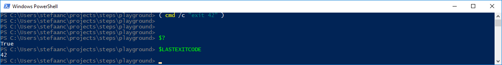
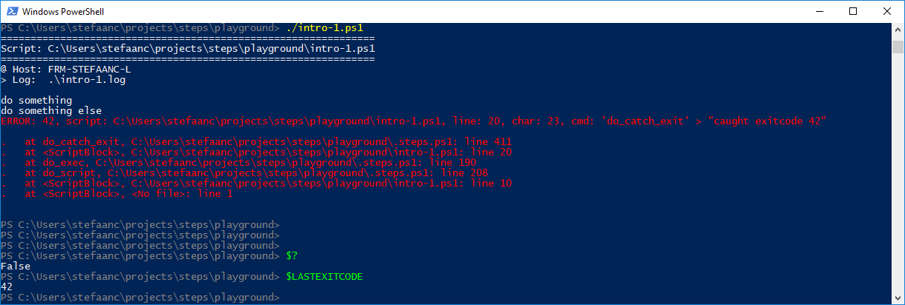
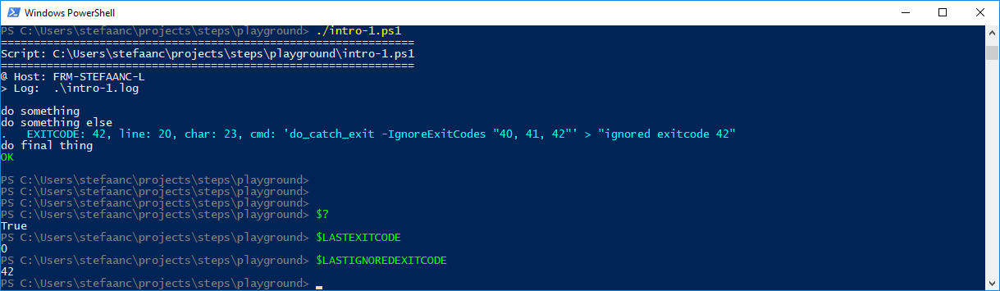

## Native Commands That Use Exitcode for Status-Info

Some native commands use the exitcode to provide status-info to the calling script.  When the standard output stream (`stdout`) is used for output that is typically captured in a file or piped to another command, then one of the only two ways a native command can provide extra information without polluting the standard output, is to provide it through the exitcode (the second way is for the native command to write status-information to the error stream).

The problem with this is that exitcodes are usually picked-up as an error, as illustrated in the next script

```powershell
#
# Intro-1.ps1
#

$STEPS_LOG_FILE = "./intro-1.log"

. ./.steps.ps1
trap { do_trap }

do_script

#
do_step "do something"

Write-Output "doing something"

#
do_step "do something else"

( cmd /c "exit 42" ); do_catch_exit   # <<<<<<<<<<<<<<<<<<<<<<<<<<<<<<<<<<<<<<<<

#
do_step "do final thing"

Write-Output "doing final thing"

#
do_exit 0
```

- `cmd /c "exit 42"` uses its exit-code to return some status-indication.
- `do_catch_exit` is the way you would typically catch error exits from a native command

When we execute this command in a powershell, then we get



However, in our script, this is picked up as an error by `do_catch_exit`



One option to solve this is to not use `do_catch_exit` at all.  However, this means you also don't catch `$? -eq False`, or any exit-codes that are not a status-indication but that are a valid error.

For that reason, `do_catch_exit` has a couple of parameters:
- `-IgnoreExitStatus` will ignore the `$?` variable
- `-IgnoreExitCode` will ignore any exit-codes.    The ignored exit-code is available through `$LASTIGNOREDEXITCODE`.
- `-IgnoreExitCodes "40, 41, 42"` will ignore a set of exit-codes, but still catch any other exit-codes.  The list of exit-codes has to be a string with comma-separated or space-separated exit-codes.  The ignored exit-code is available through `$LASTIGNOREDEXITCODE`.

Let's slightly modify our script

```powershell
#
# Intro-1.ps1
#

$STEPS_LOG_FILE = "./intro-1.log"

. ./.steps.ps1
trap { do_trap }

do_script

#
do_step "do something"

Write-Output "doing something"

#
do_step "do something else"

( cmd /c "exit 42" ); do_catch_exit -IgnoreExitCodes "40, 41, 42"   #<<<<<<<<<<<

#
do_step "do final thing"

Write-Output "doing final thing"

#
do_exit 0
```

Now we get


