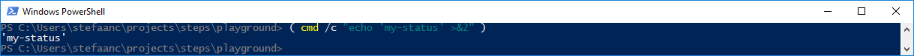
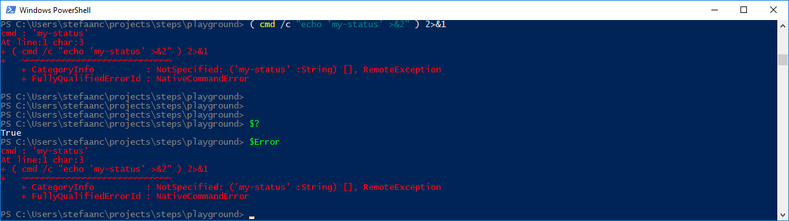
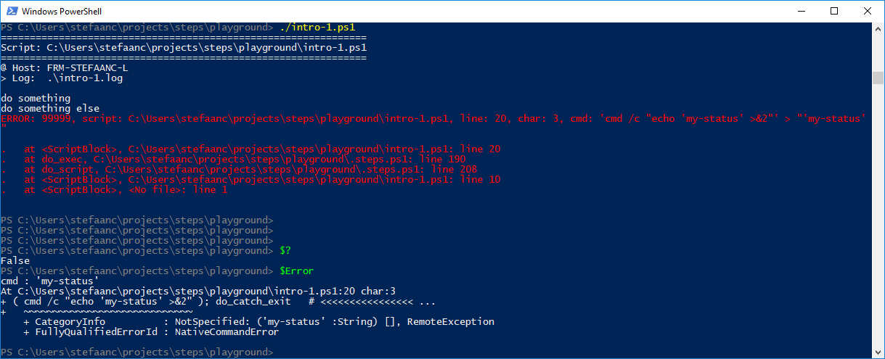
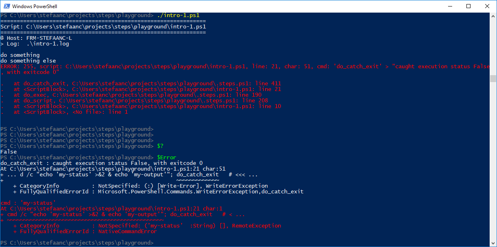
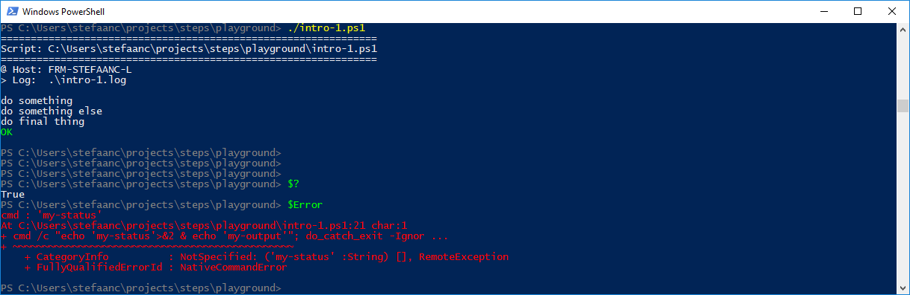

## Native Commands That Write Status-Info To stderr

Some native commands, like `curl` or `openssl`, write status-info to the standard error stream (`stderr`).  When the standard output stream (`stdout`) is used for output that is typically captured in a file or piped to another command, then one of the only two ways a native command can provide extra information without polluting the standard output, is to write to the error stream (the second way is for the native command to use the exit-code to return a status-indication).

Let's write a script to simulate this

```powershell
#
# Intro-1.ps1
#

$STEPS_LOG_FILE = "./intro-1.log"

. ./.steps.ps1
trap { do_trap }

do_script

#
do_step "do something"

Write-Output "doing something"

#
do_step "do something else"

( cmd /c "echo 'my-status'>&2" ); do_catch_exit   # <<<<<<<<<<<<<<<<<<<<<<<<<<<<

#
do_step "do final thing"

Write-Output "doing final thing"

#
do_exit 0
```

- `cmd /c "echo 'my-status'>&2"` writes a status message to `stderr`
- `do_catch_exit` is the way you would typically catch error exits from a native command

When we execute this in a powershell, then we get



However, as soon as we redirect the error stream, powershell picks the output on `stderr` up and transforms it into a powershell error.  This is **by-design**, and there is no way to avoid this.  We get



- Remark that this is a non-terminating error - `$?` is true, indicating that the command successfully completed.
- Remark that the output-string from `stderr` becomes the error-message.

When you use the STEPS library, all streams except for the "Information" stream are redirected to a log-file, hence triggering powershell to transform the output on `stderr` into a powershell error.  
The powershell error is non-terminating.  However, since STEPS always sets `$ErrorActionPreference = 'Stop'`, this error is transformed into a terminating error.



- Remark that this is now a terminating error - `$?` is false, indicating that the command failed.

<br/>

There are a couple of things we can do to solve this behaviour:
- [Capture the error in a try-catch statement](#capture-the-error-in-a-try-catch-statement)
- [Temporarily set `$ErrorActionPreference = 'Continue'`](#temporarily-set-erroractionpreference--continue)
- [Run the command in a script-block](#run-the-command-in-a-script-block)

<br/>

### Capture the error in a try-catch statement

We can capture the error in a try-catch statement, hence avoiding that it gets picked up by `trap { do_trap }`

```powershell
#
# Intro-1.ps1
#

$STEPS_LOG_FILE = "./intro-1.log"

. ./.steps.ps1
trap { do_trap }

do_script

#
do_step "do something"

Write-Output "doing something"

#
do_step "do something else"

try { ( cmd /c "echo 'my-status'>&2" ) } catch { do_continue }; do_catch_exit   # <<<<<<<<<<

#
do_step "do final thing"

Write-Output "doing final thing"

#
do_exit 0
```

- the try-catch statement catches the error thrown by powershell
- `do_continue` resets the `$?` and `$LASTEXITCODE` variables.  
  
  In this example, this is not strictly required, because the catch statement resets `$?` and the `cmd` command doesn't set `$LASTEXITCODE`, however other commands do set `$LASTEXITCODE` - f.i. try with `openssl genrsa 2048` (although one could argue that this is because of the below problem)


- Remark that the error was caught by the catch statement and was now turned back into a non-terminating error - `$?` is true, indicating that the command successfully completed (did it really ?).
- `do_continue` resets the `$?` and `$LASTEXITCODE`

This solution seems to work, but there may still be problems.  This solution does **not** work when the command writes status-info to `stderr` before it completely finishes whatever it is supposed to do.

```powershell
#
# Intro-1.ps1
#

$STEPS_LOG_FILE = "./intro-1.log"

. ./.steps.ps1
trap { do_trap }

do_script

#
do_step "do something"

Write-Output "doing something"

#
do_step "do something else"

try { ( cmd /c "echo 'my-status'>&2 & echo 'my-output'" ) } catch { do_continue }; do_catch_exit # <<<<<<<<<<

#
do_step "do final thing"

Write-Output "doing final thing"

#
do_exit 0
```

Although we get an all-clear on the terminal, like above.  If we look into the log-file, we don't see the output of the command.

```text

#
# ===============================================================
# Script: C:\Users\stefaanc\Projects\steps\playground\intro-1.ps1
# ===============================================================
#
# @ Host: FRM-STEFAANC-L
# > Log:  .\intro-1.log
#


#
# do something
#

doing something

#
# do something else
#
                                 # <<<<<<<<<<<<<<<<<<<<<<<<<<<<<<<<<<<<<<<<<<<<<

#
# do final thing
#

doing final thing

# ==============================
```

- Remark that we don't see `my-status` because that was converted to the message of the error we caught, and we didn't write the error to output.
- Remark that we expected to see `my-output`

The problem is that as soon as powershell picks up something from `stderr`, the command gets killed.  The solution is to make sure powershell does not transform the `stderr` output into an error.

<br/>

### Temporarily set `$ErrorActionPreference = 'Continue'`

We can temporarily relax the error-action preference to avoid that the output to `stderr` triggers an error.

```powershell
#
# Intro-1.ps1
#

$STEPS_LOG_FILE = "./intro-1.log"

. ./.steps.ps1
trap { do_trap }

do_script

#
do_step "do something"

Write-Output "doing something"

#
do_step "do something else"

$ErrorActionPreference = 'Continue'   # <<<<<<<<<<<<<<<<<<<<<<<<<<<<<<<<<<<<<<<<
( cmd /c "echo 'my-status'>&2 & echo 'my-output'" ); do_catch_exit
$ErrorActionPreference = 'Stop'       # <<<<<<<<<<<<<<<<<<<<<<<<<<<<<<<<<<<<<<<<

#
do_step "do final thing"

Write-Output "doing final thing"

#
do_exit 0
```

> :bulb:  
> You could use `Invoke-Command` or `Invoke-Expression` with an option `-ErrorAction 'Continue'` to get the same effect.

If we now look at the terminal, we get an all-clear like above.


- Remark that `$Error` on the terminal gives red output.  Compare this to the screenshot where we used the try-catch statement, you can see that the `$Error` output was white.  
  I didn't investigate in detail what the difference is between red and white errors.  This is left for futher research.  

  > :information_source:  
  > If you use `$ErrorActionPreference = 'SilentlyContinue'` instead of `$ErrorActionPreference = 'Continue'`, the `$Error` output will be white.  
  > Both preferences lead to the same result when using STEPS.

If we look at the log-file

```text

#
# ===============================================================
# Script: C:\Users\stefaanc\Projects\steps\playground\intro-1.ps1
# ===============================================================
#
# @ Host: FRM-STEFAANC-L
# > Log:  .\intro-1.log
#


#
# do something
#

doing something

#
# do something else
#

cmd : 'my-status' 
At C:\Users\stefaanc\Projects\steps\playground\intro-1.ps1:21 char:3
+ ( cmd /c "echo 'my-status'>&2 & echo 'my-output'" ); do_catch_exit
+   ~~~~~~~~~~~~~~~~~~~~~~~~~~~~~~~~~~~~~~~~~~~~~~~
    + CategoryInfo          : NotSpecified: ('my-status' :String) [], RemoteException
    + FullyQualifiedErrorId : NativeCommandError
 
'my-output'

#
# do final thing
#

doing final thing

# ==============================
```

- Remark we now see `my_status` and `my_output` in the log-file.

<br/>

In the previous, we have been hiding an issue with the way we called our native command.  Let's slightly modify our script

```powershell
#
# Intro-1.ps1
#

$STEPS_LOG_FILE = "./intro-1.log"

. ./.steps.ps1
trap { do_trap }

do_script

#
do_step "do something"

Write-Output "doing something"

#
do_step "do something else"

$ErrorActionPreference = 'Continue'
cmd /c "echo 'my-status'>&2 & echo 'my-output'"; do_catch_exit   # <<<<<<<<<<<<<
$ErrorActionPreference = 'Stop'

#
do_step "do final thing"

Write-Output "doing final thing"

#
do_exit 0
```

- Remark that we dropped the `()` around our `cmd` command

Running this gives



- The reason is that, although we made the error non-terminating, the `$?` variable still returns `False`, meaning that the command failed.  
  By encapsulating the command in parentheses, the closing parenthesis behaves like a separate command and sets the `$?` variable to `True`, meaning that this command successfully completed.

Solutions to the problem are:
- add parentheses around your native commands
- add an option `-IgnoreExitStatus` to `do_catch_exit`

  > :information_source:
  > `do_catch_exit` has a couple of parameters:
  > - `-IgnoreExitStatus` will ignore the `$?` variable
  > - `-IgnoreExitCode` will ignore any exit-codes.    The ignored exit-code is available through `$LASTIGNOREDEXITCODE`.
  > - `-IgnoreExitCodes "40, 41, 42"` will ignore a set of exit-codes, but still catch any other exit-codes.  The list of exit-codes has to be a string with comma-separated or space-separated exit-codes.  The ignored exit-code is available through `$LASTIGNOREDEXITCODE`.

To illustrate the second solution
```powershell
#
# Intro-1.ps1
#

$STEPS_LOG_FILE = "./intro-1.log"

. ./.steps.ps1
trap { do_trap }

do_script

#
do_step "do something"

Write-Output "doing something"

#
do_step "do something else"

$ErrorActionPreference = 'Continue'
cmd /c "echo 'my-status'>&2 & echo 'my-output'"; do_catch_exit -IgnoreExitStatus   # <<<<<<<<<<
$ErrorActionPreference = 'Stop'

#
do_step "do final thing"

Write-Output "doing final thing"

#
do_exit 0
```



<br/>

### Run the command in a script-block

As a variation on the previous solution, we can also run the native command in a script-block with relaxed error-action preference

```powershell
#
# Intro-1.ps1
#

$STEPS_LOG_FILE = "./intro-1.log"

. ./.steps.ps1
trap { do_trap }

do_script

#
do_step "do something"

Write-Output "doing something"

#
do_step "do something else"

& {                                                   # <<<<<<<<<<<<<<<<<<<<<<<<<
    $ErrorActionPreference = 'Continue'               # <<<<<<<<<<<<<<<<<<<<<<<<<
    cmd /c "echo 'my-status'>&2 & echo 'my-output'"   # <<<<<<<<<<<<<<<<<<<<<<<<<
}; do_catch_exit                                      # <<<<<<<<<<<<<<<<<<<<<<<<<

#
do_step "do final thing"

Write-Output "doing final thing"

#
do_exit 0
```

- `$ErrorActionPreference = 'Continue'` makes sure we don't capture non-terminating errors inside the script-block.
- Remark that compared to the previous solution.
  - we don't need to restore `$ErrorActionPreference = 'Stop'`
  - we don't need to encapsulate the command in `()` or to use the option `-IgnoreExitStatus` for `do_catch_exit`

> :bulb:
> Remark that you can also use `{}` instead of `&{}`.  This way the non-terminating error will not be added to the `$Error` array.  However, that means you cannot get to the status-info from the command in any way, other than looking in the log-file.
