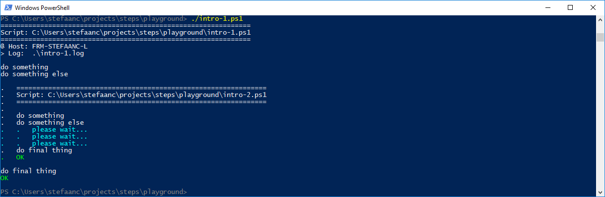

## Nesting Scripts

To illustrate nested scripts, create two scripts "intro-1.ps1" and "intro-2.ps1".  Modify the basic script "intro-1.ps1" to make a call to "intro-2.ps1".  Modify the basic script "intro-2.ps1" to provide more information to the terminal, and drop the `$STEPS_LOG_FILE` setting.

```powershell
#
# Intro-1.ps1
#

$STEPS_LOG_FILE = ".\intro-1.log"

. ./.steps.ps1
trap { do_trap }

do_script

#
do_step "do something"

Write-Output "doing something"

#
do_step "do something else"

& .\Intro-2.ps1                  # <<<<<<<<<<<<<<<<<<<<<<<<<<<<<<<<<<<<<<<<<<<<<

#
do_step "do final thing"

Write-Output "doing final thing"

#
do_exit 0
```

```powershell
#
# Intro-2.ps1
#
                                 # <<<<<<<<<<<<<<<<<<<<<<<<<<<<<<<<<<<<<<<<<<<<<

. ./.steps.ps1
trap { do_trap }

do_script

#
do_step "do something"

Write-Output "doing something"

#
do_step "do something else"

for ($i = 1; $i -le 3; $i++) {   # <<<<<<<<<<<<<<<<<<<<<<<<<<<<<<<<<<<<<<<<<<<<<
    do_echo "please wait..."     # <<<<<<<<<<<<<<<<<<<<<<<<<<<<<<<<<<<<<<<<<<<<<
    Start-Sleep 1                # <<<<<<<<<<<<<<<<<<<<<<<<<<<<<<<<<<<<<<<<<<<<<
}                                # <<<<<<<<<<<<<<<<<<<<<<<<<<<<<<<<<<<<<<<<<<<<<

#
do_step "do final thing"

Write-Output "doing final thing"

#
do_exit 0
```

- `& Intro-2.ps1` in the first script, calls the second script.  Remark that the `&` call-operator is required if we want to see the proper indentation on our terminal.
- `$STEPS_LOG_FILE` is dropped from the second script, so we get all output in a single log-file.

When running the script, our terminal will now look something like



And the log-file will look something like

```text

#
# ======================================================
# Script: C:\Users\stefaanc\steps\playground\intro-1.ps1
# ======================================================
#
# @ Host: FRM-STEFAANC-L
# > Log:  .\intro-1.log
#


#
# do something
#

doing something

#
# do something else
#


#
# ======================================================
# Script: C:\Users\stefaanc\steps\playground\intro-2.ps1
# ======================================================
#


#
# do something
#

doing something

#
# do something else
#

# please wait...
# please wait...
# please wait...

#
# do final thing
#

doing final thing

# ==============================


#
# do final thing
#

doing final thing

# ==============================
```
