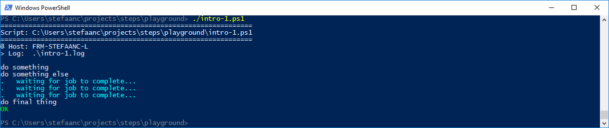
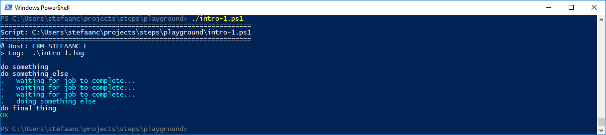
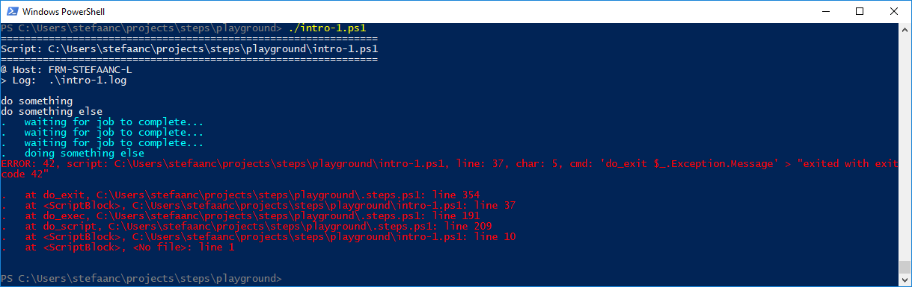

## Providing Information During Long-Running Native Commands

In PowerShell you would normally use the progress stream to provide progress-information.  When using a native command that is not possible.  However, when these commands take a long time to complete, you may want to provide some kind of info.

### Providing Information

Lets write a script to run our long-running native command in the background, while providing some information as long as it is running.

```powershell
#
# Intro-1.ps1
#

$STEPS_LOG_FILE = ".\intro-1.log"

. ./.steps.ps1
trap { do_trap }

do_script

#
do_step "do something"

Write-Output "doing something"

#
do_step "do something else"

$job = Start-Job {                                        # <<<<<<<<<<<<<<<<<<<<<<<<<<<<<<
    Start-Sleep 10                                        # <<<<<<<<<<<<<<<<<<<<<<<<<<<<<<
}                                                         # <<<<<<<<<<<<<<<<<<<<<<<<<<<<<<
do_cleanup '$job | Remove-Job'                            # <<<<<<<<<<<<<<<<<<<<<<<<<<<<<<

while ( ( $job.State -ne "Completed" ) -and ( $job.State -ne "Failed" ) ) {   # <<<<<<<<<<
    do_echo "waiting for job to complete..."              # <<<<<<<<<<<<<<<<<<<<<<<<<<<<<<
    Start-Sleep 5                                         # <<<<<<<<<<<<<<<<<<<<<<<<<<<<<<
}                                                         # <<<<<<<<<<<<<<<<<<<<<<<<<<<<<<

#
do_step "do final thing"

Write-Output "doing final thing"

#
do_exit 0
```

- the first set of commands starts the background job with our long-running native command - simulated by `Start-Sleep` - and schedules a cleanup action when we exit our script.
- the second set of commands provides some information to the user, as long as the background job is running.




<br/>


### Capturing Output

If our native command provides output, we may want to show it on the terminal (or alternatively write to log).

```powershell
#
# Intro-1.ps1
#

$STEPS_LOG_FILE = ".\intro-1.log"

. ./.steps.ps1
trap { do_trap }

do_script

#
do_step "do something"

Write-Output "doing something"

#
do_step "do something else"

$job = Start-Job {                                        # <<<<<<<<<<<<<<<<<<<<<<<<<<<<<<
    Write-Output "doing something else"                   # <<<<<<<<<<<<<<<<<<<<<<<<<<<<<<
    Start-Sleep 10                                        # <<<<<<<<<<<<<<<<<<<<<<<<<<<<<<
}                                                         # <<<<<<<<<<<<<<<<<<<<<<<<<<<<<<
do_cleanup '$job | Remove-Job'                            # <<<<<<<<<<<<<<<<<<<<<<<<<<<<<<

while ( ( $job.State -ne "Completed" ) -and ( $job.State -ne "Failed" ) ) {   # <<<<<<<<<<
    do_echo "waiting for job to complete..."              # <<<<<<<<<<<<<<<<<<<<<<<<<<<<<<
    Start-Sleep 5                                         # <<<<<<<<<<<<<<<<<<<<<<<<<<<<<<
}                                                         # <<<<<<<<<<<<<<<<<<<<<<<<<<<<<<

Receive-Job -Job $job | do_echo                           # <<<<<<<<<<<<<<<<<<<<<<<<<<<<<<

#
do_step "do final thing"

Write-Output "doing final thing"

#
do_exit 0
```

- we added a line to our background job, writing something to output.
- we added a command to capture the output from the background process.




<br/>

### Catching The Exit-code

When our native command fails, we want to catch the exit-code

```powershell
#
# Intro-1.ps1
#

$STEPS_LOG_FILE = ".\intro-1.log"

. ./.steps.ps1
trap { do_trap }

do_script

#
do_step "do something"

Write-Output "doing something"

#
do_step "do something else"

$job = Start-Job {                                        # <<<<<<<<<<<<<<<<<<<<<<<<<<<<<<
    Write-Output "doing something else"                   # <<<<<<<<<<<<<<<<<<<<<<<<<<<<<<
    Start-Sleep 10                                        # <<<<<<<<<<<<<<<<<<<<<<<<<<<<<<
    cmd /c "exit 42"; if ( -not $? ) { throw $LASTEXITCODE }   # <<<<<<<<<<<<<<<<<<<<<<<<<
}                                                         # <<<<<<<<<<<<<<<<<<<<<<<<<<<<<<
do_cleanup '$job | Remove-Job'                            # <<<<<<<<<<<<<<<<<<<<<<<<<<<<<<

while ( ( $job.State -ne "Completed" ) -and ( $job.State -ne "Failed" ) ) {   # <<<<<<<<<<
    do_echo "waiting for job to complete..."              # <<<<<<<<<<<<<<<<<<<<<<<<<<<<<<
    Start-Sleep 5                                         # <<<<<<<<<<<<<<<<<<<<<<<<<<<<<<
}                                                         # <<<<<<<<<<<<<<<<<<<<<<<<<<<<<<

try {                                                     # <<<<<<<<<<<<<<<<<<<<<<<<<<<<<<
    Receive-Job -Job $job | do_echo                       # <<<<<<<<<<<<<<<<<<<<<<<<<<<<<<
}                                                         # <<<<<<<<<<<<<<<<<<<<<<<<<<<<<<
catch {                                                   # <<<<<<<<<<<<<<<<<<<<<<<<<<<<<<
    do_exit $_.Exception.Message                          # <<<<<<<<<<<<<<<<<<<<<<<<<<<<<<
}                                                         # <<<<<<<<<<<<<<<<<<<<<<<<<<<<<<

#
do_step "do final thing"

Write-Output "doing final thing"

#
do_exit 0
```

- we added a failing line of code to our background job.  The exit-code of our native command is caught, and we throw an error with the exit-code in the error-message
- our line that is caturing the output of the background job is now put in a try-catch statement.  It will throw when the background job throws an error.  We catch the error-message and exit our script with that message as exit-code.


