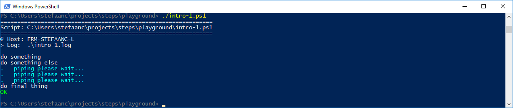
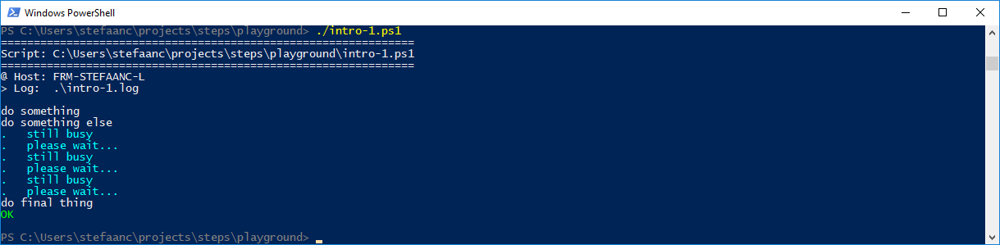
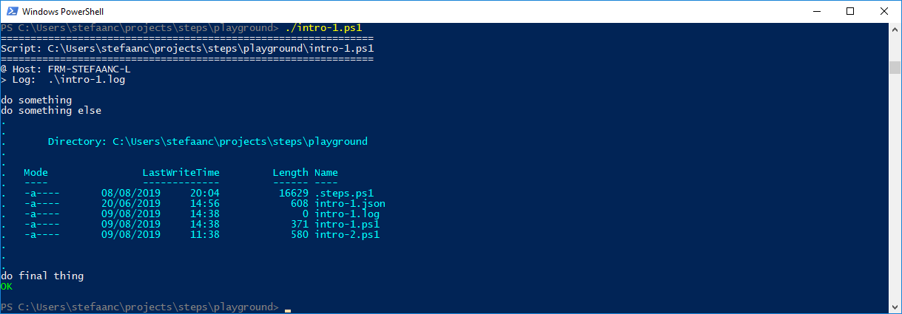

## Providing More Information

Let's modify the basic script to provide more information to the terminal.

```powershell
#
# Intro-1.ps1
#
$STEPS_LOG_FILE = ".\intro-1.log"

. ./.steps.ps1
trap { do_trap }

do_script

#
do_step "do something"

Write-Output "doing something"

#
do_step "do something else"

for ($i = 1; $i -le 3; $i++) {   # <<<<<<<<<<<<<<<<<<<<<<<<<<<<<<<<<<<<<<<<<<<<<
    do_echo "please wait..."     # <<<<<<<<<<<<<<<<<<<<<<<<<<<<<<<<<<<<<<<<<<<<<
    Start-Sleep 1                # <<<<<<<<<<<<<<<<<<<<<<<<<<<<<<<<<<<<<<<<<<<<<
}                                # <<<<<<<<<<<<<<<<<<<<<<<<<<<<<<<<<<<<<<<<<<<<<

#
do_step "do final thing"

Write-Output "doing final thing"

#
do_exit 0
```

- `do_echo "please wait..."` writes some extra information to the terminal

When running the script, our terminal will now look something like


And the log-file will look something like

```text

#
# ======================================================
# Script: C:\Users\stefaanc\steps\playground\intro-1.ps1
# ======================================================
#
# @ Host: FRM-STEFAANC-L
# > Log:  .\intro-1.log
#


#
# do something
#

doing something

#
# do something else
#

# please wait...
# please wait...
# please wait...

#
# do final thing
#

doing final thing

# ==============================

```

<br/>

You can also pipe to `do_echo`

```powershell
#
# Intro-1.ps1
#
$STEPS_LOG_FILE = ".\intro-1.log"

. ./.steps.ps1
trap { do_trap }

do_script

#
do_step "do something"

Write-Output "doing something"

#
do_step "do something else"

for ($i = 1; $i -le 3; $i++) {
    echo "piping please wait..." | do_echo   # <<<<<<<<<<<<<<<<<<<<<<<<<<<<<<<<<
    Start-Sleep 1
}

#
do_step "do final thing"

Write-Output "doing final thing"

#
do_exit 0
```



<br/>

`do_echo` also supports multi-line strings

```powershell
#
# Intro-1.ps1
#
$STEPS_LOG_FILE = ".\intro-1.log"

. ./.steps.ps1
trap { do_trap }

do_script

#
do_step "do something"

Write-Output "doing something"

#
do_step "do something else"

for ($i = 1; $i -le 3; $i++) {
    do_echo @"                   # <<<<<<<<<<<<<<<<<<<<<<<<<<<<<<<<<<<<<<<<<<<<<
still busy                       # <<<<<<<<<<<<<<<<<<<<<<<<<<<<<<<<<<<<<<<<<<<<<
please wait...                   # <<<<<<<<<<<<<<<<<<<<<<<<<<<<<<<<<<<<<<<<<<<<<
"@                               # <<<<<<<<<<<<<<<<<<<<<<<<<<<<<<<<<<<<<<<<<<<<<
    Start-Sleep 1
}

#
do_step "do final thing"

Write-Output "doing final thing"

#
do_exit 0
```



<br/>

Finally, if you want to send the output of a powershell method to `do_echo` in table format


```powershell
#
# Intro-1.ps1
#
$STEPS_LOG_FILE = ".\intro-1.log"

. ./.steps.ps1
trap { do_trap }

do_script

#
do_step "do something"

Write-Output "doing something"

#
do_step "do something else"

Get-ChildItem | Format-Table | Out-String | do_echo   # <<<<<<<<<<<<<<<<<<<<<<<<

#
do_step "do final thing"

Write-Output "doing final thing"

#
do_exit 0
```

- `Get-ChildItem` gets the files in the current directory
- `Format-Table` formats the output into a table format
- `Out-String` converts the table-object into strings that `do_echo` can process


