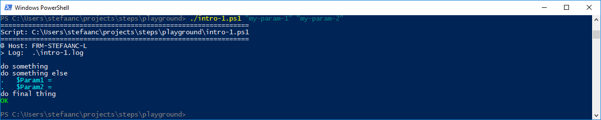
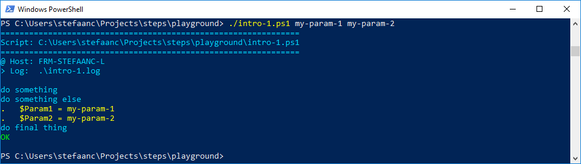

## Scripts With Parameters

Scripts with parameters cause a bit of a problem when using STEPS.  The reason for this is that STEPS will call the script again to apply the redirections.  However when it doesn't know about the parameters, then the script will be re-called without parameters.

Let's write a script with parameters.  A script with positional parameters could look something like this.

```powershell
#
# Intro-1.ps1
#
$Param1 = $args[0]               # <<<<<<<<<<<<<<<<<<<<<<<<<<<<<<<<<<<<<<<<<<<<<
$Param2 = $args[1]               # <<<<<<<<<<<<<<<<<<<<<<<<<<<<<<<<<<<<<<<<<<<<<

$STEPS_LOG_FILE = "./intro-1.log"

. ./.steps.ps1
trap { do_trap }

do_script

#
do_step "do something"

Write-Output "doing something"

#
do_step "do something else"

do_echo "`$Param1 = $Param1"     # <<<<<<<<<<<<<<<<<<<<<<<<<<<<<<<<<<<<<<<<<<<<<
do_echo "`$Param2 = $Param2"     # <<<<<<<<<<<<<<<<<<<<<<<<<<<<<<<<<<<<<<<<<<<<<

#
do_step "do final thing"

Write-Output "doing final thing"

#
do_exit 0
```

A script with named parameters could look something like this.

```powershell
#
# Intro-1.ps1
#
param (                          # <<<<<<<<<<<<<<<<<<<<<<<<<<<<<<<<<<<<<<<<<<<<<
    $Param1,                     # <<<<<<<<<<<<<<<<<<<<<<<<<<<<<<<<<<<<<<<<<<<<<
    $Param2                      # <<<<<<<<<<<<<<<<<<<<<<<<<<<<<<<<<<<<<<<<<<<<<
)                                # <<<<<<<<<<<<<<<<<<<<<<<<<<<<<<<<<<<<<<<<<<<<<

$STEPS_LOG_FILE = "./intro-1.log"

. ./.steps.ps1
trap { do_trap }

do_script

#
do_step "do something"

Write-Output "doing something"

#
do_step "do something else"

do_echo "`$Param1 = $Param1"     # <<<<<<<<<<<<<<<<<<<<<<<<<<<<<<<<<<<<<<<<<<<<<
do_echo "`$Param2 = $Param2"     # <<<<<<<<<<<<<<<<<<<<<<<<<<<<<<<<<<<<<<<<<<<<<

#
do_step "do final thing"

Write-Output "doing final thing"

#
do_exit 0
```

In both cases, the result will be



- Remark that the parameters are not written to th terminal.

<br/>

To solve this, we need to make the parameters known to the STEPS library, through the special variable `$STEPS_PARAMS`.

For positional parameters


```powershell
#
# Intro-1.ps1
#
$Param1 = $args[0]
$Param2 = $args[1]

$STEPS_PARAMS = "$Param1", "$Param2"   # <<<<<<<<<<<<<<<<<<<<<<<<<<<<<<<<<<<<<<<

$STEPS_LOG_FILE = "./intro-1.log"

. ./.steps.ps1
trap { do_trap }

do_script

#
do_step "do something"

Write-Output "doing something"

#
do_step "do something else"

do_echo "`$Param1 = $Param1"
do_echo "`$Param2 = $Param2"

#
do_step "do final thing"

Write-Output "doing final thing"

#
do_exit 0
```

- positional parameters are put in an array - a comma-separated list.

For named parameters


```powershell
#
# Intro-1.ps1
#
param (
    $Param1,
    $Param2
)

$STEPS_PARAMS = @{               # <<<<<<<<<<<<<<<<<<<<<<<<<<<<<<<<<<<<<<<<<<<<<
    Param1 = "$Param1"           # <<<<<<<<<<<<<<<<<<<<<<<<<<<<<<<<<<<<<<<<<<<<<
    Param2 = "$Param2"           # <<<<<<<<<<<<<<<<<<<<<<<<<<<<<<<<<<<<<<<<<<<<<
}                                # <<<<<<<<<<<<<<<<<<<<<<<<<<<<<<<<<<<<<<<<<<<<<

$STEPS_LOG_FILE = "./intro-1.log"

. ./.steps.ps1
trap { do_trap }

do_script

#
do_step "do something"

Write-Output "doing something"

#
do_step "do something else"

do_echo "`$Param1 = $Param1"
do_echo "`$Param2 = $Param2"

#
do_step "do final thing"

Write-Output "doing final thing"

#
do_exit 0
```

- named parameters are put in a hash table

Now, in both cases, the result will be


