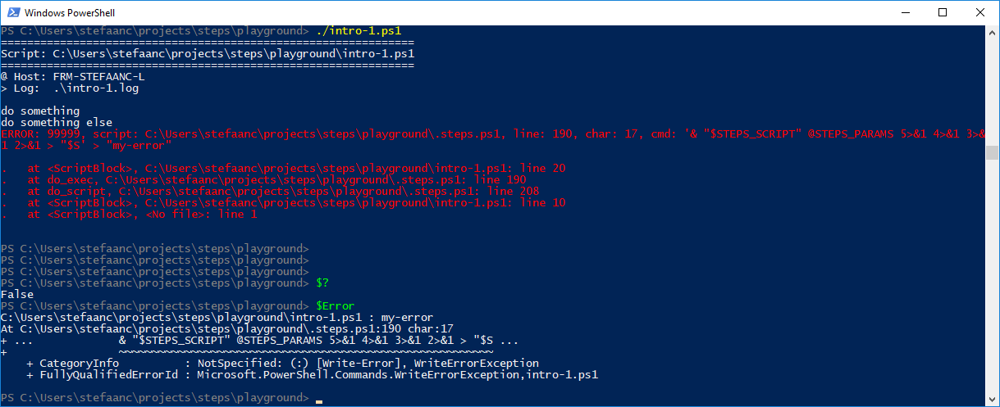
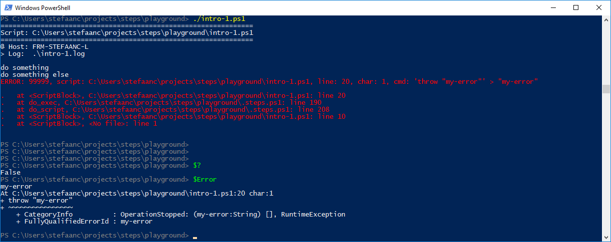
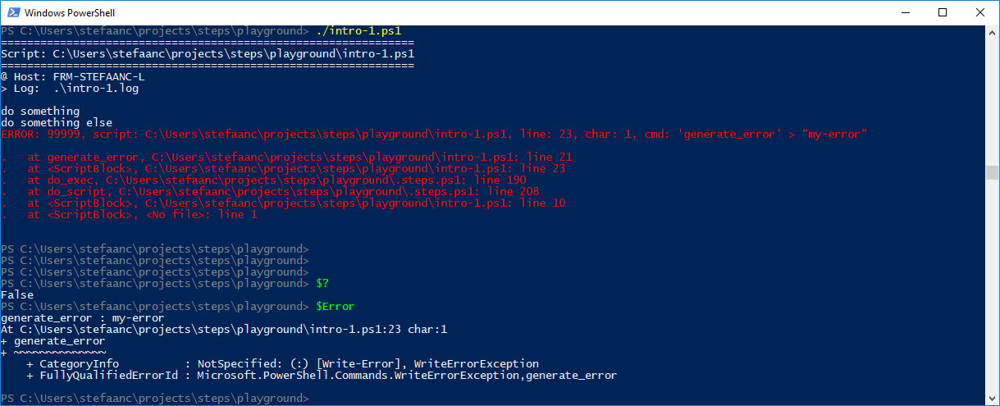
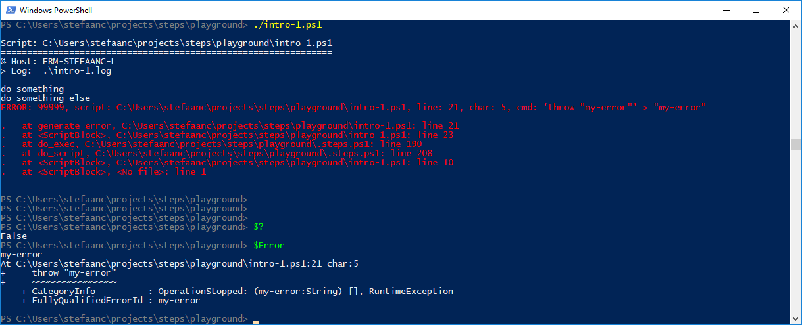
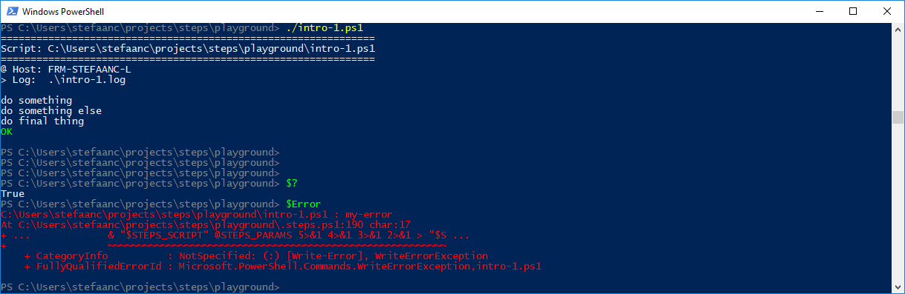
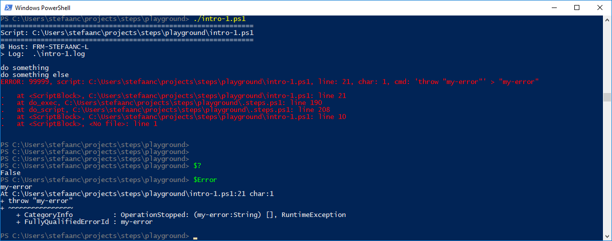

## Using Write-Error vs Throw

There are two basic methods in PowerShell to generate an error: `Write-Error` generates a non-terminating error (unless you set `$ErrorActionPreference = 'Stop'`, like STEPS does), and `throw` generates a terminating error.

We will look at two aspects of these two commands: the error-record and the error-action.

### The error-record

The error-record is what you get when you look at `$Error`.  This is also used to generate a an error-message in STEPS.

Lets first write a short script with a `Write-Error` command

```powershell
#
# Intro-1.ps1
#

$STEPS_LOG_FILE = ".\intro-1.log"

. ./.steps.ps1
trap { do_trap }

do_script

#
do_step "do something"

Write-Output "doing something"

#
do_step "do something else"

Write-Error "my-error"                       # <<<<<<<<<<<<<<<<<<<<<<<<<<<<<<

#
do_step "do final thing"

Write-Output "doing final thing"

#
do_exit 0
```

running this gives



- remark that `Write-Error` generates a terminating error because STEPS sets `$ErrorActionPreference = 'Stop'`
- remark the weird "cmd" in the error-message: `& "$STEPS_SCRIPT" @STEPS_PARAMS...`.  This is because the error-record of `Write-Error` points to the **calling script or function** of the scope where the `Write-Error` command was executed.  In this case, `.steps.ps1` (line 190) calls the original script a second time to implement the redirections, and this is the "cmd" you see in the error-record.

Lets compare this with the case where we use `throw` instead of `Write-Error`

```powershell
throw "my-error"                             # <<<<<<<<<<<<<<<<<<<<<<<<<<<<<<
```



- remark that the error-message and error-record now point to the script and line where the error was thrown.

To make it easier to see what's happening, lets use a function

```powershell
#
# Intro-1.ps1
#

$STEPS_LOG_FILE = ".\intro-1.log"

. ./.steps.ps1
trap { do_trap }

do_script

#
do_step "do something"

Write-Output "doing something"

#
do_step "do something else"

function generate_error {                    # <<<<<<<<<<<<<<<<<<<<<<<<<<<<<<
    Write-Error "my-error"                   # <<<<<<<<<<<<<<<<<<<<<<<<<<<<<<
}                                            # <<<<<<<<<<<<<<<<<<<<<<<<<<<<<<
generate_error                               # <<<<<<<<<<<<<<<<<<<<<<<<<<<<<<

#
do_step "do final thing"

Write-Output "doing final thing"

#
do_exit 0
```



- remark that the error-message and error-record point to the script and line where the function was called - i.e. **the caller of the function** where the `Write-Error` command was executed.

```powershell
function generate_error {                    # <<<<<<<<<<<<<<<<<<<<<<<<<<<<<<
    throw "my-error"                         # <<<<<<<<<<<<<<<<<<<<<<<<<<<<<<
}                                            # <<<<<<<<<<<<<<<<<<<<<<<<<<<<<<
generate_error                               # <<<<<<<<<<<<<<<<<<<<<<<<<<<<<<
```



- remark that the error-message and error-record now point to the script and line where the error was thrown **inside the function**.

> :bulb:  
> Hence, avoid using `Write-Error` in the main script when using STEPS.  The information you get in the error-record of the `throw` command is usually better.
> Use `Write-Error` instead of `throw` in functions.  The information you get in the error-record of the `Write-Error` command is usually what you are looking for.

### The error-action

The error-action defines what happens when after an error happens.  
- `'Stop'` stops the script.
- `'Continue'` writes a message to the error-stream, creates an error-record, and continues the script.
- `'SilentlyContinue'` doesn't write a message, creates an error-record, and continues the script.
- `'Ignore'` doesn't write a message, doesn't create an error-record, and continues the script.  (remark that this is only available in an `-ErrorAction` option, not as a value for the `$ErrorActionPreference` variable)

Since STEPS always sets `$ErrorActionPreference = 'Stop'`, we usually don't see any difference between `Write-Error` and `throw`.  Let's write a script where we re-set `$ErrorActionPreference = 'Continue'`

```powershell
#
# Intro-1.ps1
#

$STEPS_LOG_FILE = ".\intro-1.log"

. ./.steps.ps1
trap { do_trap }

do_script

#
do_step "do something"

Write-Output "doing something"

#
do_step "do something else"

$ErrorActionPreference = 'Continue'          # <<<<<<<<<<<<<<<<<<<<<<<<<<<<<<
Write-Error "my-error"                       # <<<<<<<<<<<<<<<<<<<<<<<<<<<<<<

#
do_step "do final thing"

Write-Output "doing final thing"

#
do_exit 0
```



- remark that `Write-Error` by default generates a non-terminating error, so the script continues and completes successfully (`$? -eq True`).  When you look in the log file, you will find that an error-record has been written.

If we now use `throw` instead of `Write-Error`

```powershell
$ErrorActionPreference = 'Continue'          # <<<<<<<<<<<<<<<<<<<<<<<<<<<<<<
throw "my-error"                             # <<<<<<<<<<<<<<<<<<<<<<<<<<<<<<
```



- remark that `throw` generates a terminating error, independent of the `$ErrorActionPreference` setting

The disadvantage of `throw` is that it's error-record is pointing to the `throw`-command, and when using this in a small function, this may not be what we want.  In the case of functions, you may want to force a terminating error, independent of the `$ErrorActionPreference` value, but typically will want the info of your function-call in the error-record instead of info of the `throw`-statement inside your function.  You can do this by using `Write-Error` with an option `-ErrorAction 'Stop'`

```powershell
$ErrorActionPreference = 'Continue'              # <<<<<<<<<<<<<<<<<<<<<<<<<<<<<<
function my_function {                           # <<<<<<<<<<<<<<<<<<<<<<<<<<<<<<
    Write-Error "my-error" -ErrorAction 'Stop'   # <<<<<<<<<<<<<<<<<<<<<<<<<<<<<<
}                                                # <<<<<<<<<<<<<<<<<<<<<<<<<<<<<<
my_function                                      # <<<<<<<<<<<<<<<<<<<<<<<<<<<<<<
```


