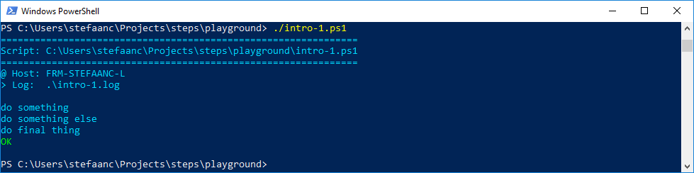

## Getting Started With STEPS In Powershell

Let's start with copying the STEPS library into our current directory.  You can find it on github in the STEPS project: `/scripts/.steps.ps1`

#### A Successful Script

Write a basic powershell script that uses STEPS
```powershell
#
# Intro-1.ps1
#
$STEPS_LOG_FILE = ".\intro-1.log"

. .steps.ps1
trap { do_trap }

do_script

#
do_step "do something"

Write-Output "doing something"

#
do_step "do something else"

Write-Output "doing something else"

#
do_step "do final thing"

Write-Output "doing final thing"

#
do_exit 0
```

- `$STEPS_LOG_FILE` is setting the log-file STEPS will use
- `. .steps.ps1` dot-sources / includes / imports the STEPS library into our script
- `trap { do_trap }` sets up a mechanism to catch the errors thrown in our script or in the STEPS library
- `do_script` initializes the STEPS library and writes a script-header to both log-file and terminal
- `do_step` writes a step-header to both log-file and terminal
- `do_exit 0` writes a script-footer to both log-file and terminal
- all other output from the script is only sent to the log-file

  > :bulb: 
  > you can also use an environment `$env:STEPS_LOG_FILE` to set the log-file
  > or perhaps you prefer a parameter in your script `param( $STEPS_LOG_FILE = $env:STEPS_LOG_FILE )`

When running the script, our terminal will now look something like



And the log-file will look something like

```text

#
# ======================================================
# Script: C:\Users\stefaanc\steps\playground\intro-1.ps1
# ======================================================
#
# @ Host: FRM-STEFAANC-L
# > Log:  .\intro-1.log
#


#
# do something
#

doing something

#
# do something else
#

doing something else

#
# do final thing
#

doing final thing

# ==============================
```

#### Generating An Error

Let's modify the script to throw an error

```powershell
#
# Intro-1.ps1
#
#...

#
do_step "do something else"

throw "my-error"

#...
```

- `throw "my-error"` throws a terminating error

  > :bulb:
  > STEPS is setting `$ErrorActionPreference = 'Stop'` to catch non-terminating errors from for instance `Write-Error "my-error"`.  If you prefer, you can reset this after you dot-sourced the library, to some other value like `'Continue'`, `'SilentlyContinue'` or `'Ignore'`.
  > Also, most powershell methods allow you to override this for a single command using an option, for instance `-ErrorAction 'Continue'`

When running the script, our terminal will now look something like


And the log-file will look something like

```text

#
# ======================================================
# Script: C:\Users\stefaanc\steps\playground\intro-1.ps1
# ======================================================
#
# @ Host: FRM-STEFAANC-L
# > Log:  .\intro-1.log
#


#
# do something
#

doing something

#
# do something else
#


#
# ERROR: 99999, line: 19, char: 1, cmd: 'throw "my-error"' > "my-error"
#

my-error
At C:\Users\stefaanc\steps\playground\intro-1.ps1:19 char:1
+ throw "my-error"
+ ~~~~~~~~~~~~~~~~
    + CategoryInfo          : OperationStopped: (my-error:String) [], RuntimeException
    + FullyQualifiedErrorId : my-error
```

#### Catching Exits

Let's modify the script to simulate a command that doesn't throw errors but instead exits with an exitcode, and then catch that exitcode.

```powershell
#
# Intro-1.ps1
#
#...

#
do_step "do something else"

cmd /c "exit 42"; do_catch_exit

#...
```

- `do_catch_exit` verifies `$?` and `$LASTEXITCODE`, and throws an error if necessary

When running the script, our terminal will now look something like


And the log-file will look something like

```text

#
# ======================================================
# Script: C:\Users\stefaanc\steps\playground\intro-1.ps1
# ======================================================
#
# @ Host: FRM-STEFAANC-L
# > Log:  .\intro-1.log
#


#
# do something
#

doing something

#
# do something else
#


#
# ERROR: 42, line: 19, char: 19, cmd: 'do_catch_exit' > "caught exitcode 42"
#
```

#### Providing More Information

Let's modify the script to provide more information to the terminal.

```powershell
#
# Intro-1.ps1
#
#...

#
do_step "do something else"

for ($i = 1; $i -le 3; $i++) {
    do_echo "please wait..."
    Start-Sleep 1
}

#...
```

- `do_echo "please wait..."` writes some extra information to the terminal

When running the script, our terminal will now look something like


And the log-file will look something like

```text

#
# ======================================================
# Script: C:\Users\stefaanc\steps\playground\intro-1.ps1
# ======================================================
#
# @ Host: FRM-STEFAANC-L
# > Log:  .\intro-1.log
#


#
# do something
#

doing something

#
# do something else
#

.   please wait...
.   please wait...
.   please wait...

#
# do final thing
#

doing final thing

# ==============================

```

#### Nesting Scripts

To illustrate nested scripts, copy "intro-1.ps1" to "intro-2.ps1".  Then modify "intro-1.ps1" to make a call to "intro-2.ps1", and drop the `$STEPS_LOG_FILE` setting from "intro-2.ps1"

```powershell
#
# Intro-1.ps1
#
$STEPS_LOG_FILE = ".\intro-1.log"

. .steps.ps1
trap { do_trap }

#...

#
do_step "do something else"

& .\Intro-2.ps1

#...
```

```powershell
#
# Intro-2.ps1
#

. .steps.ps1
trap { do_trap }

#...

#
do_step "do something else"

for ($i = 1; $i -le 3; $i++) {
    do_echo "please wait..."
    Start-Sleep 1
}

#...
```

- `& Intro-2.ps1` in the first script, calls the second script.  Remark that the `&` call-operator is required if we want to see the proper indentation on our terminal.
- `$STEPS_LOG_FILE` is dropped from the second script, so we get all output in a single log-file.

When running the script, our terminal will now look something like


And the log-file will look something like

```text

#
# ======================================================
# Script: C:\Users\stefaanc\steps\playground\intro-1.ps1
# ======================================================
#
# @ Host: FRM-STEFAANC-L
# > Log:  .\intro-1.log
#


#
# do something
#

doing something

#
# do something else
#


#
# ======================================================
# Script: C:\Users\stefaanc\steps\playground\intro-2.ps1
# ======================================================
#


#
# do something
#

doing something

#
# do something else
#

.   please wait...
.   please wait...
.   please wait...

#
# do final thing
#

doing final thing

# ==============================


#
# do final thing
#

doing final thing

# ==============================
```

#### Appending To A Log-file

Let's change back to our original "Intro-1.ps1" script, and add an option to append to the log-file.

```powershell
#
# Intro-1.ps1
#
$STEPS_LOG_FILE = ".\intro-1.log"
$STEPS_LOG_APPEND = "true"

#...

#
do_step "do something else"

Write-Output "doing something else"

#...
```

- `$STEPS_LOG_APPEND = "true"` appends the output to the log-file.

  > :bulb:
  > Use a value "$null", "" or "false" to override `$env:STEPS_LOG_APPEND = "true"`

When running the script, the log-file will look something like

```text

#
# ======================================================
# Script: C:\Users\stefaanc\steps\playground\intro-1.ps1
# ======================================================
#
# @ Host: FRM-STEFAANC-L
# > Log:  .\intro-1.log
#


#
# do something
#

doing something

#
# do something else
#


#
# ======================================================
# Script: C:\Users\stefaanc\steps\playground\intro-2.ps1
# ======================================================
#


#
# do something
#

doing something

#
# do something else
#

.   please wait...
.   please wait...
.   please wait...

#
# do final thing
#

doing final thing

# ==============================


#
# do final thing
#

doing final thing

# ==============================


#
# ======================================================
# Script: C:\Users\stefaanc\steps\playground\intro-1.ps1
# ======================================================
#
# @ Host: FRM-STEFAANC-L
# >> Log: .\intro-1.log
#


#
# do something
#

doing something

#
# do something else
#

doing something else

#
# do final thing
#

doing final thing

# ==============================

```

- remark that the first part of the log-file is from our previous test

#### Changing Colors

You can change the colors using another variable in the script or environment.

```powershell
#
# Intro-1.ps1
#
$STEPS_LOG_FILE = ".\intro-1.log"

$e = [char]27
$STEPS_COLORS = "$e[38;5;246m,$e[92m,$e[93m,$e[91m,$e[0m"
#                normal     ,green ,yellow,red   ,reset

. .steps.ps1
trap { do_trap }

#...
```

- `$e = [char]27` gives us the ASCII code 27 for "escape".
- `$STEPS_COLORS = "$e[...` defines the "normal", "green", "yellow", "red" and "reset" color-codes in a comma separated list without spaces.  In the example, we changed the "normal" color from the default code for powershell (`$e[38;5;45m`) to the code we typically use as for bash (`$e[38;5;246m`).

  > :bulb:
  > For a good overview of the ANSI/VT100 color-codes, [click here](https://misc.flogisoft.com/bash/tip_colors_and_formatting)

When running the script, our terminal will now look something like


